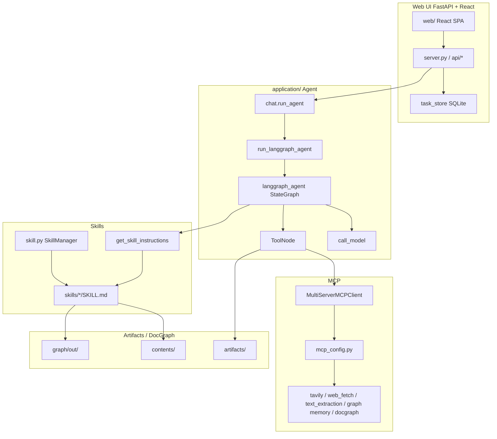
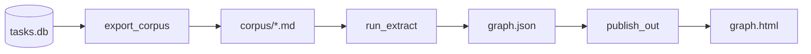

# DocGraph Intelligence

[한국어](./README_kr.md)

To leverage important internal documents in an AI application, you need excellent OCR to use figures and tables effectively, and you should improve usability with an Agent. Here we explain how to extract sufficient information from documents as text using the strong image-analysis capabilities of OpenAI's GPT models, implement it as a knowledge graph, and use it with an agent. Knowledge graph generation draws on the **LLM Wiki** concept from **Andrej Karpathy**, former OpenAI co-founder; for synonym performance we use vector embeddings to implement **hybrid search** on **docgraph**. When a user uploads files in the Agent, a multimodal parser performs OCR and extracts a knowledge graph. Depending on the user's question, MCP retrieves related documents from the graph, and SKILL can generate reports. We use **LangGraph**, the most widely used agent framework in Korea, and the Web UI is built with **FastAPI + React**.

Below is the agent architecture using DocGraph. You can enforce access control so external traffic cannot reach the app through the VPC, and use serverless **ECS Fargate** to run the Agent without heavy infrastructure operations.


The following describes the overall system layout. Users connect through the browser Web UI, and the LangGraph Agent searches and uses the knowledge graph via MCP and Skills.

| Component | Path | Role |
|-----------|------|------|
| Web UI | `application/server.py`, `application/web/` | Task·Chat·Skill/MCP settings, SSE streaming |
| Agent | `application/chat.py` → `langgraph_agent.py` | LangGraph ReAct + MCP + Skills |
| Graph pipeline | `graph/` | tasks.db → corpus → LLM extraction → `graph.html` |
| Graph API | `application/api/routes_graph.py`, `graph_query.py` | HTML serving · document search · rebuild |
| Config | `application/config.json`, `mcp.list`, `skills.list` | Model·MCP·Skill·LiteLLM gateway defaults |

```text
Browser (React :8501)
    │  REST + SSE (/api/...)
    ▼
FastAPI (application/server.py)
    │  chat.run_agent(...)
    ▼
LangGraph (langgraph_agent) + MCP + Skills + OpenAI (LiteLLM gateway)
```


### Key Usage Flow

1. **Chat** — Create a Task, choose Skill/MCP, then ask questions. Responses stream over SSE and are stored in `tasks.db`.
2. **Open Knowledge Graph** — Click sidebar brand **DocGraph (user)** → modal iframe shows `GET /api/graph` HTML.
3. **Switch pattern** — In the graph UI, choose Force Atlas / Neo4j Explore / Holistic View → saves `graph_pattern` in `settings.json` and regenerates HTML only.
4. **Document search** — Natural-language question in the graph **Document search** panel → related nodes + corpus body excerpts.
5. **Manual/incremental extraction** — As conversations accumulate, use a background job or `graph/run_pipeline.py` to refresh corpus and graph.
6. **DocGraph Sync** — Settings → **DocGraph** → Configure / Sync / Graph to graph PDFs and Sources (`/api/docgraph/*`).

### Directory Structure (Summary)

```text
docgraph-intelligence/
├── application/          # FastAPI · LangGraph · React web · Skills · MCP
│   ├── server.py
│   ├── chat.py / langgraph_agent.py
│   ├── graph_query.py / graph_jobs.py / docgraph_jobs.py
│   ├── api/routes_graph.py / routes_docgraph.py
│   ├── mcp_server_docgraph.py / mcp_server_graph_memory.py
│   └── web/              # React SPA
├── graph/                # Knowledge Graph + DocGraph Sync pipeline
│   ├── run_pipeline.py
│   ├── sync_docgraph.py
│   ├── export_corpus.py / run_extract.py / publish_out.py
│   └── lib/              # semantic, patterns, ask_panel, …
├── installer.py / uninstaller.py
├── README.md / README_kr.md
└── requirements.txt
```

Per-user session data (conversation DB, Knowledge Graph, DocGraph, settings) lives under `.session_storage/{user}/`. Knowledge Graph is at `{user}/graph/out/graph.html`; DocGraph is at `{user}/docgraph/graphify-out/`. See [Knowledge Graph](#knowledge-graph) · [DocGraph](#docgraph) · [graph/README.md](./graph/README.md) for details.

## Operation Architecture



| Screen / Feature | Description |
|------------------|-------------|
| Task Chat | Per-task session + SSE streaming (`chat.run_agent`). Pin, rename, delete supported |
| Skill / MCP | Choose Skill·MCP in sidebar (defaults e.g. graphify, **tavily**, **graph memory**, **docgraph**) |
| File upload | Attach images·documents and pass to Agent |
| Knowledge Graph | Settings → **Knowledge** → Graph, or brand click → `KnowledgeGraphModal` → `/api/graph` |
| DocGraph | Settings → **DocGraph** → Sync / Graph / Configure |
| Settings | Knowledge On/Off·Sync, DocGraph Sync, `graph_pattern`, and other user settings |

The Agent runs a ReAct loop with tools (MCP) and Skill instructions.


### DocGraph vs RAG 

| **When DocGraph shines** | **When RAG shines** |
|---|---|
| Complex questions spanning multiple documents | Large-scale data that changes in real time |
| When deep understanding and synthesis are needed | Simple fact lookup |
| Expert-curated corpus | When provenance tracking matters |
| Questions requiring structural reasoning | When fast deployment is needed |

docgraph-intelligence provides both a **chat Agent (MCP)** and **graph document search** together. (Separate RAG/KB upload has been removed.) The graph side enriches answers by traversing `graph.json` + source excerpts without an embedding index.


## Graph 

docgraph-intelligence includes a Knowledge Graph that provides memory-style features such as personalized recommendations from conversation content, and DocGraph that pulls information from documents. Inputs, storage locations, and pipelines differ; visualization patterns (Force Atlas / Neo4j Explore / Holistic View) and document search UI are shared.

| | **Knowledge Graph** | **DocGraph** |
|--|---------------------|----------------|
| Source | Agent conversations (`tasks.db`) | `raw` / Sources / DocGraph folders |
| Root | `.session_storage/{user}/graph/` | `.session_storage/{user}/docgraph/` |
| Output | `out/graph.html` · `graph.json` | `docgraph/graphify-out/app-graph.html` · `graph.json` |
| API | `GET /api/graph`, `POST /api/graph/query` | `GET /api/docgraph/graph`, `POST /api/docgraph/query` |
| Refresh | Settings → **Knowledge** → Sync (`POST /api/graph/rebuild`) | Settings → DocGraph → **Sync** |
| View | Settings → Knowledge → **Graph** / brand click | Settings → DocGraph → **Graph** |
| Agent MCP | **`graph memory`** → `recall_graph_memory` | **`docgraph`** → `recall_docgraph` |


### Using Graphs

Both Knowledge Graph and DocGraph publish `graph.json` as **vis-network** HTML. The same graph data is rendered in three UI patterns by `patterns.py`. Knowledge Graph stores the pattern in user `settings.json` as `graph_pattern`; DocGraph stores it in `graphify-out/.wiki_graph_pattern`. Switching patterns regenerates **HTML only** without re-extraction.


```text
Sidebar "DocGraph (user)" click
  → KnowledgeGraphModal + iframe
  → GET /api/graph  (graph.html from session cookie)
```

| API | Role |
|-----|------|
| `GET /api/graph` | Inline display of user graph HTML |
| `GET /api/graph/status` | Existence · job status · enabled |
| `POST /api/graph/rebuild` | Enqueue background pipeline |
| `POST /api/graph/query` | Knowledge Graph document search (BFS/DFS + excerpt) |
| `GET /api/docgraph/graph` | DocGraph HTML |
| `POST /api/docgraph/query` | DocGraph document search (same engine) |

If no graph exists yet, a guidance HTML is shown; reopen the modal after extraction completes. If older HTML lacks the document search UI, the server attempts republish from `graph.json`.

| Pattern | Menu name | Implementation | Layout / Visual |
|---------|-----------|----------------|-----------------|
| **pattern1** | Force Atlas | [pattern1_html.py](./graph/lib/pattern1_html.py) | `forceAtlas2Based`. Large `dot` nodes scaled by degree, community-colored curved edges (`curvedCCW`), relation labels. INFERRED shown as dashed. |
| **pattern2** | Neo4j Explore | [pattern2_html.py](./graph/lib/pattern2_html.py) | Neo4j Explore/Bloom style. Dark canvas, small `dot` nodes, thin gray continuous curved edges, hub-focused labels. Physics uses `barnesHut`. |
| **pattern3** | Holistic View | [pattern3_html.py](./graph/lib/pattern3_html.py) | Neo4j Browser-style full overview. `fit` on load. `ellipse` label nodes + relation names (uppercase) on edges. `forceAtlas2Based`. |

Shared UI: group (community) legend filter, top-left **Document search** (Enter to query; search box and results in one card), node click details (source·relations), pattern switch buttons.

```text
graph.json (+ communities)
        │
        ▼
  patterns.write_pattern_html(pattern1|2|3)
        │
        ▼
  out/graph.html  ← Ask panel (ask_panel.py) injected
        │  POST /api/graph/query
        ▼
  application/graph_query.query_user_graph()
```

### Graphify T-Box

**Graphify**'s T-Box is the set of edge types (relation values) hardcoded inside `extract.py` source. Unlike OWL/RDF, predefined edge types are used as follows.

```
Graphify T-Box location:
  add_edge() calls inside graphify/extract.py
      ↓
  "relation": "calls" | "imports" | "contains" | "inherits" | ...
```


#### Code Analysis Edge Types (AST-based — `EXTRACTED`)

| Edge type | Confidence | Meaning | Example |
|---|---|---|---|
| `contains` | EXTRACTED | File contains class/function | `auth.py` → `DigestAuth` |
| `imports` | EXTRACTED | File imports module | `main.py` → `requests` |
| `imports_from` | EXTRACTED | File imports from specific module | `auth.py` → `models` |
| `inherits` | EXTRACTED | Class inherits parent class | `DigestAuth` → `Auth` |
| `method` | EXTRACTED | Class has method | `DigestAuth` → `.authenticate()` |

#### Code Analysis Edge Types (Call Graph — `INFERRED`)

| Edge type | Confidence | Meaning | Example |
|---|---|---|---|
| `calls` | INFERRED | Function/method calls another function | `.authenticate()` → `.hash()` |
| `uses` | INFERRED | Cross-file import resolution | `DigestAuth` → `Response` |

#### Document/Image/PDF Edge Types (LLM Semantic Analysis)

Document processing lets the LLM (OpenAI GPT) create edges in free form; below are semantic relations the LLM infers.

| Edge type | Example |
|---|---|
| `references` | Paper A cites Paper B |
| `explains` | Document explains a concept |
| `depends_on` | Module depends on another module |
| `defines` | File defines a concept |
| Other free-form | LLM judges from context |

#### Confidence Labels

| Tag | Meaning |
|---|---|
| `EXTRACTED` | **Directly verified** fact from source (import statement, class declaration, etc.) |
| `INFERRED` | **Reasonable inference** (call graph, co-occurrence) |
| `AMBIGUOUS` | **Uncertain** — needs review in GRAPH_REPORT.md |

Confidence tags use the concept of confidence metadata defined in Graphify.


#### How T-Box and A-Box Are Separated

```
Graphify T-Box                    Graphify A-Box
────────────────────              ───────────────────────────────────
Set of "relation" values           Actual nodes + edges in graph.json

contains                           DigestAuth --contains--> .authenticate()
imports                            auth.py --imports_from--> models
imports_from                       httpx.py --imports--> ssl
inherits                           BasicAuth --inherits--> AuthBase
method                             Client --method--> .send()
calls       (INFERRED)             .build_request() --calls--> .encode()
uses        (INFERRED)             DigestAuth --uses--> Response
```

#### Graphify T-Box vs Other Tools

| | **Graphify** | **Graphiti** | **OWL/RDF** |
|---|---|---|---|
| **T-Box location** | Hardcoded in `extract.py` | Pydantic model files | `.ttl` / `.owl` files |
| **T-Box customization** | ❌ Requires source edit | ✅ Define Pydantic models | ✅ Fully free |
| **Confidence tagging** | ✅ EXTRACTED/INFERRED/AMBIGUOUS | ❌ (replaced by temporal validity) | ❌ |
| **Domain reasoning** | ❌ | ❌ | ✅ HermiT/Pellet |
| **Update mode** | `--update` (A-Box only) | `add_episode()` real-time | Direct triplestore edit |
| **T-Box stability** | Changes only on version upgrade | Changeable anytime | Changeable anytime |
| **Primary purpose** | Code/document structure understanding | AI agent memory | Semantic web standard |


### graph.json Generation and Usage

`graph.json` is generated and used as follows.

① Ingest: run graphify . → automatic file analysis → graph.json created
② Update:  graphify . --update → incremental merge after SHA256 check on changed files only
③ Use:      graphify query / path / explain or direct Python analysis of graph.json

```
┌─────────────────────────────────────────────────────┐
│                   graph.json                        │
│                                                     │
│  T-Box: kinds of "relation" values                    │
│         (calls, contains, inherits ...)             │
│                                                     │
│  A-Box: actual instance data                          │
│         nodes: [{id, label, file_type, ...}]        │
│         links: [{source, target, relation, ...}]    │
└─────────────────────────────────────────────────────┘
```


### Graph Pattern

These patterns all use the **same `graph.json`**; the difference is what you see at a glance. You can also inspect node and edge relationships through the graph and verify extraction quality via isolated graph counts.

#### Force Atlas (pattern1)

`forceAtlas2Based` spreads communities apart; high-degree nodes appear larger; edges show community color + relation labels (INFERRED dashed).

| Pros | Cons |
|------|------|
| Hub·community structure is intuitive | Busy on dense graphs with many nodes·labels |
| Relation types·confidence visible on canvas | Force Atlas computation relatively heavy |
| Good balance for exploration·explanation | Focuses on local structure more than full terrain |

**Best for:** Explaining how concepts cluster and what relations connect them.

Graph screen shown with Force Atlas.


#### Neo4j Explore (pattern2)

Explore/Bloom feel with **small dots + thin gray curves**. Edge labels·arrows mostly hidden; fast `barnesHut` physics.

| Pros | Cons |
|------|------|
| Terrain·clusters visible even at scale | Relation names·direction only via hover/detail |
| Low visual noise; easy scroll·zoom | Small hub size differences; weaker importance cues |
| Relatively light stabilization·render | Weaker for explaining who references whom |

**Best for:** Scanning overall shape·density·community distribution of large graphs.

Graph screen shown with Neo4j Explore.


#### Holistic View (pattern3)

`fit` on load to show everything; `ellipse` label nodes + relation names (uppercase)·arrows. Force Atlas with strong overlap avoidance.

| Pros | Cons |
|------|------|
| Full overview + relation labels together | Readability drops sharply when edge labels overlap |
| Close to Neo4j Browser one-glance schema | Text saturates with many nodes·edges |
| Good for relation-centric explanation·demo | Weaker terrain feel than Explore |

**Best for:** One-shot summary including relation types at medium scale.

**One-line summary:** Structure·hubs → **Force Atlas**, scale·terrain → **Neo4j Explore**, relation labels at a glance → **Holistic View**.

Graph screen shown with Holistic View.


### Knowledge Graph

A graph viewed in a modal when you click the sidebar brand, extracting entities·relations from **chat conversations**. Instead of relying only on the Cursor `/graphify` Skill, the standalone [`graph/`](./graph/) pipeline builds **tasks.db → corpus → graph.json → HTML**. The orchestrator is [run_pipeline.py](./graph/run_pipeline.py).

#### Folder Locations

| Role | Path |
|------|------|
| Pipeline code | `docgraph-intelligence/graph/` (`run_pipeline.py`, `export_corpus.py`, …) |
| User workspace | `{SESSION_STORAGE}/.session_storage/{user}/graph/` |
| Corpus | `…/graph/corpus/*.md` |
| Artifacts | `…/graph/out/graph.json`, `graph.html` (+ `GRAPH_REPORT.md`, `node_embeddings.json`) |
| Input DB | `tasks.db` (Agent conversations) |

Example: `{user}/graph/out/graph.html` → `GET /api/graph`

#### Generation Process



```text
tasks.db
  → export_corpus   (turn → corpus/*.md, SHA256 cache·delta)
  → run_extract     (LLM semantic extraction → nodes/edges)
  → build_graph     (cluster → graph.json + GRAPH_REPORT.md)
  → publish_out     (pattern1/2/3 → graph.html + document search panel)
```

| Step | Script / Module | LLM? | What it does |
|------|-----------------|------|--------------|
| 1. Turn extraction | [tasks_db.py](./graph/lib/tasks_db.py) `build_turns` | No | Build user↔assistant **turn** pairs from SQLite |
| 2. Corpus export | [export_corpus.py](./graph/export_corpus.py) + [corpus.py](./graph/lib/corpus.py) | No | Save turns as YAML frontmatter + body `.md`. `--user` defaults to **delta** (changes only) + SHA256 cache miss enqueued in [extract_queue](./graph/lib/extract_queue.py) |
| 3. Semantic extraction | [run_extract.py](./graph/run_extract.py) → [semantic.py](./graph/lib/semantic.py) | **Yes** | Pass corpus chunks (default 8 files) to LLM for nodes/edges/hyperedges JSON. LLM called via [llm.py](./graph/lib/llm.py) through LiteLLM gateway or Bedrock Converse |
| 4. Graph build | [build_graph.py](./graph/lib/build_graph.py) `build_and_export` | No | graphifyy `build_from_json` → Leiden/Louvain **cluster** → God Node·surprising link analysis → `graph.json` + `GRAPH_REPORT.md` |
| 5. HTML publish | [publish_out.py](./graph/publish_out.py) → [out_graphs.py](./graph/lib/out_graphs.py) / [patterns.py](./graph/lib/patterns.py) | No | Render `graph.json` as Force Atlas / Neo4j Explore / Holistic View HTML |

**Where relations are created:** Leiden/Louvain only **partition communities**. Edges and confidence come from explicit JSON output by the step-3 LLM.

| relation (examples) | Meaning |
|---------------------|---------|
| `references` / `calls` / `implements` / `cites` | Explicit reference·call·implementation·citation |
| `conceptually_related_to` / `shares_data_with` | Concept·data relatedness |
| `semantically_similar_to` | Same problem without structural link (usually INFERRED) |
| `rationale_for` | Design rationale → target concept |


| confidence | Meaning |
|------------|---------|
| EXTRACTED | Stated in source (score 1.0) |
| INFERRED | Inference (usually 0.6–0.9) · may show dashed in HTML |
| AMBIGUOUS | Uncertain (0.1–0.3) |


### DocGraph

Create DocGraph via Settings → DocGraph → **Sync** (`docgraph_jobs.py` background). See [Graph](#graph) below for visualization patterns·document search. To search the DocGraph corpus from the chat Agent, enable **`docgraph`** in Settings → MCP. Tool `recall_docgraph` uses the same `query_user_graph()` path as `POST /api/docgraph/query`. See [Agent MCP (graph memory · docgraph)](#agent-mcp-graph-memory--docgraph) for details.


#### Core Loop

```
Raw data ingestion → LLM compiles & maintains wiki·graph → Query → outputs saved back to wiki → compounding knowledge
```

| Item | Description |
|------|-------------|
| Storage format | Structured **Markdown files** (Obsidian-compatible) |
| Infrastructure | RAG pipeline not required; vector DB not required |
| Automation | Index, summaries, topic backlinks·communities |
| Linting | Detect inconsistencies; surface gaps needing new articles |
| Output formats | Markdown reports, Marp slides, Matplotlib charts, interactive graph HTML |
| Long-term vision | Synthetic data + fine-tuning → internalize corpus in model weights |


#### Folder Locations

| Role | Path |
|------|------|
| DocGraph root | `.session_storage/{user}/docgraph/` (per logged-in user) |
| Inbox | `{docgraph}/raw/` — collect originals you want to ingest |
| Sources | Settings → DocGraph → Configure (max 3, `{docgraph}/wiki_sources.json`) |
| Output directory | `{docgraph}/graphify-out/` |
| App HTML | `graphify-out/app-graph.html` → `GET /api/docgraph/graph` |
| JSON | `graphify-out/graph.json` |

```text
application/.session_storage/{user}/docgraph/
├── raw/                   # papers·notes·PDFs·URL captures (inbox)
├── wiki_sources.json      # Sync Sources · URL history (per user)
└── graphify-out/
    ├── converted/         # PDF/Office → markdown conversions
    ├── graph.json
    ├── GRAPH_REPORT.md
    ├── app-graph.html     # app DocGraph UI
    └── cache/             # SHA256 cache (reprocess changed files only)
```

> **Note:** Upstream graphify `detect()` by default creates `{source}/graphify-out/converted` **next to** the Source folder. DocGraph Sync moves this to the user's `{docgraph}/graphify-out/converted`, then places PDF etc. semantic markdown in the same place. `graphify-out` beside Source is not Sync output.


#### Generation Process

```text
Sources / raw (or DocGraph root if absent)
  → detect (incremental: per-source mtime diff → new/changed only; multiple Source+raw folders also incremental)
  → AST extraction (code)
  → semantic extraction (.md; pdf/txt converted to md first)
  → build + cluster
  → graphify-out/graph.json · GRAPH_REPORT.md
  → republish → app-graph.html (Force Atlas / Neo4j / Holistic)
```

Incremental Sync re-extracts **only changed·new files** when `graph.json` + `manifest.json` exist, regardless of Source count. If you enable Foundation Model Parser later, already-processed PDFs are not rerun; only newly added files use current parser settings. Full reprocessing requires Sync full mode when needed.
Upstream graphify CLI pipeline (same family):

```
detect() → extract() → build_graph() → cluster() → analyze() → report() → export()
```

Install (upstream CLI / Skill):

```text
pip install graphifyy && graphify install
/graphify .   # run on current folder
```

#### Adding Documents (`raw` · Sources)

DocGraph originals accumulate in the **`raw` inbox**. `raw` is not auto-created by Sync; it is **where you collect corpus you want to ingest**.

Settings → DocGraph → Sync uses `raw/` if present; otherwise the entire DocGraph root. Configure Sources to extract those folders (max 3).

#### Purpose of `raw`

- Folder for **originals you want in the graph**: papers·notes·screenshots·code·PDFs, etc.
- Copy·move manually, or use `/graphify add <url>` to save URLs into `./raw`
- Sync / `/graphify` reads this folder (or specified path) and builds graph in `graphify-out/`

Example: only `/document/doc/doc01.pdf` exists

It does **not** appear in `raw` automatically.

| Action | What appears in `raw` |
|--------|----------------------|
| Do nothing | nothing |
| Copy·move file to `{docgraph}/raw/` | `doc01.pdf` (as placed) |
| `/graphify /document/doc` | Extracts **that path directly** (no copy into raw) |
| `/graphify add <url>` | Fetched content saved in `./raw` |

In the app, Settings → DocGraph → **Configure** sets up to 3 Sync **Sources** (folder menu when Source selected); URLs save immediately to that user's `{docgraph}/raw`. URL history·Sources stored in `{docgraph}/wiki_sources.json`. View results via **Sync** then **Graph**.

Semantic stage uses `.md` as input, so Source `.pdf`/`.txt` are converted to text markdown during Sync (images skipped — no vision).

#### URL Resource Collection

When you **add** a URL in Configure, `graphify.ingest` fetches the resource over HTTP(S) and saves it to that user's `{docgraph}/raw`. Sync does not re-fetch URLs; it only extracts files already in `raw` (+ configured folders).

| URL type | Behavior |
|----------|----------|
| Regular web page | Fetch HTML, convert to markdown `.md` with `html2text` |
| PDF / image | Download as binary |
| tweet / arXiv / YouTube / GitHub, etc. | Per-type branching (oEmbed, abstract, audio, etc.) |

Implementation is **server-side HTTP fetch + HTML→markdown** (`urllib`-based `safe_fetch`), not browser automation (Playwright, etc.). Only http/https allowed; private IPs·cloud metadata endpoints blocked. JS-only sites may capture little body text.

#### Supported Files (upstream /graphify Skill)

- Code: .py, .ts, .js, .go, .rs, .java, .cpp, etc.
- Documents: .md, .txt, .docx, etc.
- Papers: .pdf
- Images: .png, .jpg, .webp (vision analysis — CLI/Skill; app DocGraph Sync skips images)
- Video/Audio: .mp4, .mp3, .wav (Whisper transcription)


#### Markdown File Generation (Extract)

Semantic extraction uses **markdown (or plain text)** as input. Conversion timing differs by type; app DocGraph Sync is handled by [`graph/sync_docgraph.py`](./graph/sync_docgraph.py). Code is not converted to md; only AST extraction.

```text
Sources / raw
  → detect()          # classify + Office(.docx/.xlsx) → md sidecar
  → [DocGraph Sync] relocate → {docgraph}/graphify-out/converted/
  → AST extract       # code only (no md conversion)
  → semantic extract  # docs/papers: stage as md then LLM extract, stage PDF/txt/md → converted/      
  → merge → graph.json
```

| Type | Conversion | Implementation | DocGraph Sync |
|------|------------|----------------|---------------|
| **Code** (.py, .ts, .js, .go, …) | No md conversion · AST extract | `graphify.extract` | Same |
| **.md / .txt / .rst** | Stage as-is (chunk if long ~10KB) | `_doc_to_markdown_body` / `_stage_docs_as_markdown` | `converted/{name}.md` or `{stem}_partNN.md` |
| **.docx / .xlsx** | Office→md at `detect()` | `graphify.detect.convert_office_file` (python-docx / openpyxl) | Relocate sidecar beside Source to DocGraph `converted/` |
| **.pdf** | Page text → md wrapper (default pdfplumber/pypdf; Foundation Model Parser On → PDF→image→LLM) | [`graph/pdf2text.py`](./graph/pdf2text.py) | Stage as `# stem` + `## Page N` |
| **Images** (.png, .jpg, .webp) | CLI/Skill: vision direct (no pre-md) | Skill semantic sub-agent | **skip** |
| **Video/Audio** | Whisper → `.txt` → treat as docs | `graphify.transcribe` (faster-whisper) | Sync **not supported** |
| **URL (web page)** | HTML→md at ingest | `graphify.ingest` (`html2text`) | Saved in `raw/*.md` · Sync does not re-fetch |


**Documents (.md / .txt)** `_doc_to_markdown_body` reads UTF-8; `_stage_docs_as_markdown` writes to `{docgraph}/graphify-out/converted/`. Short `.md` (≤12KB) copied with original filename; long docs chunked ~10,000 chars as `{stem}_part01.md` … + YAML frontmatter (`source_file`, `chunk`).

**Office:** Heading→`#`/`##`, lists→`-`, tables·excel sheets→markdown tables. Filename `{stem}_{pathHash8}.md`; detect list gets this sidecar, not the original. (docx: `python-docx`, xlsx: `openpyxl`)

#### Papers (.pdf) — Sync Staging

Default (Foundation Model Parser **Off**): `_pdf_to_text` → classical path in [`graph/pdf2text.py`](./graph/pdf2text.py)

1. **pdfplumber** per-page text → `## Page N`
2. Fallback **pypdf** on failure

When **Foundation Model Parser** is **On** in DocGraph Configure (default Off), uses the same multimodal path as rag-multimodal:

1. **PyMuPDF** renders page PNGs (`page_001.png` …) → `{docgraph}/graphify-out/converted/.pdf_pages/{stem}_{hash}/pages/`
2. Each image converted to Markdown via multimodal LLM (OpenAI/gateway) (`mcp_server_text_extraction` · img2text prompt)
3. **Per page** append `## Page N` to `.pdf_pages/.../extracted.md` (+fsync). If Sync interrupts, next Sync resumes (finished pages·PNGs skipped)
4. When complete, stage to `converted/{stem}.md` (or `_partNN.md`). On failure (only when no partial md), fallback to classical (pdfplumber/pypdf)

Then stage to `converted/` in this form and pass to `extract_corpus`:

```text
# {filename stem}

Source: `{original path}`

## Page 1
…
```

Long PDFs split like Documents into ~10KB chunks (`{stem}_partNN.md`) + YAML frontmatter (`source_file`, `chunk`). After extraction, `_rewrite_extract_sources` restores node·edge `source_file` to the **original PDF path**. Conversions remain in `{docgraph}/graphify-out/converted/` for debugging.

Upstream CLI/Skill may keep PDF as binary for sub-agent reading, but app Sync always converts to text md first.


### Graph Extraction

The graph combines **structural extraction (AST)** and **semantic extraction (LLM)**. Leiden/Louvain do not create relations; LLM·AST specify edge JSON first, then communities partition on top.

| Path | Target | Implementation | LLM? |
|------|--------|----------------|------|
| **AST** | Code (.py, .ts, .go, …) | `graphify.extract` | No (deterministic import·calls, etc.) |
| **Semantic** | Docs·papers (after .md staging) | DocGraph Sync: [`graph/lib/semantic.py`](./graph/lib/semantic.py) · Skill: sub-agent | Yes |

```text
detect → AST extract + semantic extract (parallel possible)
  → merge (.graphify_extract.json)
  → build_from_json → cluster → graph.json / GRAPH_REPORT.md / HTML
```

- **DocGraph Sync / Knowledge Graph pipeline:** Instead of Cursor `/graphify` Skill, LiteLLM gateway (OpenAI) extracts per-chunk JSON with `EXTRACT_SYSTEM` prompt. Chunk size **8**, smaller than Skill (20–25).
- **Cursor `/graphify` Skill:** Dispatches parallel sub-agent prompts per chunk with same schema. (Image vision·video Whisper only in Skill/CLI)

#### Semantic Extraction Prompt

Source: [`graph/lib/semantic.py`](./graph/lib/semantic.py) (`EXTRACT_SYSTEM` + `extract_chunk`). Same family as upstream [graphify Skill](https://github.com/safishamsi/graphify) Part B.

**System prompt (`EXTRACT_SYSTEM`):**

```python
EXTRACT_SYSTEM = """You are a graphify extraction agent. Read the documents and extract a knowledge graph fragment.
Output ONLY valid JSON matching the schema - no explanation, no markdown fences, no preamble.

Rules:
- EXTRACTED: relationship explicit in source (import, call, citation, "see §3.2")
- INFERRED: reasonable inference (shared data structure, implied dependency)
- AMBIGUOUS: uncertain - flag for review, do not omit

Doc files: extract named concepts, entities, citations. Also extract rationale — sections that explain WHY a decision was made, trade-offs chosen, or design intent. These become nodes with `rationale_for` edges pointing to the concept they explain.

Semantic similarity: if two concepts solve the same problem without structural link, add `semantically_similar_to` (INFERRED, confidence_score 0.6-0.95).

Hyperedges: if 3+ nodes clearly participate together beyond pairwise edges, add up to 3 hyperedges.

If a file has YAML frontmatter (--- ... ---), copy source_url, captured_at, author, contributor onto every node from that file.
Also copy user_id from frontmatter into author when author is null.

confidence_score is REQUIRED on every edge:
- EXTRACTED: always 1.0
- INFERRED: 0.6-0.9 typically
- AMBIGUOUS: 0.1-0.3

Output exactly this JSON shape:
{"nodes":[{"id":"filestem_entityname","label":"Human Readable Name","file_type":"document","source_file":"relative/path","source_location":null,"source_url":null,"captured_at":null,"author":null,"contributor":null}],"edges":[{"source":"node_id","target":"node_id","relation":"calls|implements|references|cites|conceptually_related_to|shares_data_with|semantically_similar_to|rationale_for","confidence":"EXTRACTED|INFERRED|AMBIGUOUS","confidence_score":1.0,"source_file":"relative/path","source_location":null,"weight":1.0}],"hyperedges":[{"id":"snake_case_id","label":"Human Readable Label","nodes":["n1","n2","n3"],"relation":"participate_in|implement|form","confidence":"EXTRACTED|INFERRED","confidence_score":0.75,"source_file":"relative/path"}],"input_tokens":0,"output_tokens":0}
"""
```

**User message construction (`extract_chunk`):** Append chunk file bodies; add one DEEP_MODE line when `--deep`.

```python
def extract_chunk(files, *, corpus_root, chunk_num, total_chunks, deep=False, model=None):
    parts = [f"Files (chunk {chunk_num} of {total_chunks}):"]
    for path in files:
        rel = _rel_path(path, corpus_root)
        parts.append(f"\n===== FILE: {rel} =====\n{_read_doc(path)}")

    if deep:
        parts.append(
            "\nDEEP_MODE: be aggressive with INFERRED edges - indirect deps, "
            "shared assumptions, latent couplings. Mark uncertain ones AMBIGUOUS."
        )

    user = "\n".join(parts)
    data = chat_json(
        [
            {"role": "system", "content": EXTRACT_SYSTEM},
            {"role": "user", "content": user},
        ],
        model=model,
    )
    # …
```

| Rule | Description |
|------|-------------|
| **EXTRACTED** | Relation explicit in source · `confidence_score` = 1.0 |
| **INFERRED** | Reasonable inference · usually 0.6–0.9 |
| **AMBIGUOUS** | Do not omit even if uncertain · 0.1–0.3 |
| **`--deep`** | Aggressive INFERRED · mark ambiguous as AMBIGUOUS |

#### How to Run

| Method | Example |
|--------|---------|
| App DocGraph Sync | Settings → DocGraph → **Sync** (`sync_docgraph.py`) |
| Knowledge Graph pipeline | `cd graph && python run_pipeline.py` / `run_extract.py` |
| Cursor Skill | `/graphify <path>` · incremental `/graphify <path> --update` · deep reasoning `--mode deep` |

Incremental mode uses SHA256 **cache** to re-extract changed files only. Code-only changes run AST only and skip semantic LLM.


---

### Document search

Graph HTML **Document search** runs from the top-left `Search entities...` input on Enter. Question → related node traversal → **source file body excerpts** in the same card. Knowledge Graph uses `POST /api/graph/query`, DocGraph uses `POST /api/docgraph/query`; both use `query_user_graph()` in [graph_query.py](./application/graph_query.py). Default is `graph.json` + source files; **embedding hybrid** selects start nodes (no vector DB — `node_embeddings.json` sidecar).

1. **UI** — [ask_panel.py](./graph/lib/ask_panel.py) CSS/HTML/JS injected into all three pattern HTMLs. Top-left search Enter → Knowledge `POST /api/graph/query`, DocGraph `POST /api/docgraph/query` (`credentials: same-origin`). Legend auto-hides on search.
2. **API** — [routes_graph.py](./application/api/routes_graph.py) / [routes_docgraph.py](./application/api/routes_docgraph.py) resolve session user `graph.json` path then call `query_user_graph()`.
3. **Start node matching** (lexical ∪ embedding)
   - Tokenize query (English ≥3 chars, CJK ≥2 chars).
   - Partial match on node **label** for top candidates.
   - Even when label is empty (or to supplement), boost score when query terms appear in `source_file` **body** — e.g. English labels with Korean query.
   - **Embedding**: Compare question and node label vectors with an embedding model (cosine ≥ 0.35). Catches synonyms like `날씨` ↔ `Weather` without label partial match. `out/node_embeddings.json` built at publish/`republish`; lazy rebuild on query if missing or stale. Lexical only if gateway unset·fails.
4. **Graph traversal** — Default **BFS** (depth 3), optional **DFS** (depth 6). Collect related nodes·edges, sort by relevance, truncate with token `budget`.
5. **Source excerpt** — Read matching nodes' `source_file` only inside allowed roots; show paragraphs overlapping query·label·`source_location` in panel.
6. **Graph highlight** — Raise response node opacity; chip click `focus`es that node.

**Embedding config:** Embedding hybrid (vector search) in document search only when `application/config.json` **`hybrid_graph_search`** is `"enable"`. Any other value (or unset) uses lexical only. Current default is `"enable"`.

The embedding model is configurable via LiteLLM gateway, `application/config.json`, and environment variables (`GRAPHIFY_EMBEDDING_MODEL`, `GRAPHIFY_EMBEDDING_DIM`) so you can match your deployment.

#### Hybrid Behavior (example: query `"날씨"`)

It does **not** build a synonym list then run lexical search again. Lexical and embedding both **pick start nodes**; the main body is **graph traversal**.

```text
Query "날씨"
  ├─ 1. Lexical ──► partial match "날씨" in label/body → start nodes (max 3)
  ├─ 2. Embedding ► query vector ↔ node label vectors (cosine) → supplement start nodes (combined max 5)
  └─ 3. BFS/DFS ─► expand neighbors from start nodes → 4. source excerpt
```

1. **Lexical (literal)**  
   - Token `["날씨"]` partial string match on node **label** → `Weather API` label not caught here.  
   - Also checks node `source_file` **body** for `"날씨"` → may catch if corpus has Korean.

2. **Embedding (semantic similarity)** — parallel supplement, not follow-up lexical  
   - Load `node_embeddings.json` (node label vectors) from publish (lazy rebuild if missing/stale).  
   - Embed query `"날씨"` **once** with the configured embedding model.  
   - Cosine compare all node vectors (≥ 0.35), top-k **merged** with lexical results.  
   - No step that builds `"weather"` via synonym dict·translation then re-matches labels. Picks **existing node IDs** where vectors are close, e.g. `날씨` ↔ `Weather Forecast`.

3. **Graph traversal** — BFS (depth 3) or DFS (depth 6) from merged `start_nodes`. Not embedding/lexical re-search.

4. **Excerpt** — Show paragraphs from source of traversed nodes overlapping query·label.

| Step | `"날씨"` example |
|------|----------------|
| Lexical label | No `"날씨"` → 0 hits |
| Lexical body | Some nodes if corpus has `날씨` sentences |
| Embedding | Adds start nodes if labels like `Weather…`, `korea_weather` are similar |
| BFS/DFS | Expand related concept·tool nodes connected to those |
| Excerpt | Show matching md paragraphs |

Response `match_via` like `embed`, `source+embed`, `label+source+embed` shows where start points came from.

**One line:** Query embedding → compare with pre-built node label vectors → supplement start nodes → graph traversal. Does not run lexical again after building synonyms.

App document search reuses BFS/DFS·budget concepts from CLI `/graphify query` (CLI itself has no embedding). See [graph/README.md](./graph/README.md) for pipeline·LLM settings.

Document search finds related nodes from start nodes as shown below.


You can retrieve related documents from the corpus as a result.


### Agent MCP (graph memory · docgraph)

The chat Agent can call the same engine as graph HTML **Document search** (`query_user_graph`) via MCP tools. Enable servers in Settings → **MCP**; the Agent uses tools for relevant questions.

| MCP (`mcp.list`) | Tool | Target graph | Same HTTP API | Implementation |
|------------------|------|--------------|---------------|----------------|
| **`graph memory`** | `recall_graph_memory(question, mode?, budget?)` | Knowledge Graph (`{user}/graph/out/graph.json`) | `POST /api/graph/query` | `mcp_server_graph_memory.py` → `mcp_graph_memory.py` |
| **`docgraph`** | `recall_docgraph(question, mode?, budget?)` | DocGraph (`{user}/docgraph/graphify-out/graph.json`) | `POST /api/docgraph/query` | `mcp_server_docgraph.py` → `mcp_docgraph.py` |

Shared behavior:

- `mode`: `"bfs"` (default) or `"dfs"`, `budget`: soft size (default 2000)
- On success `{"text": [{"type":"excerpt","source":"...","text":"...","related_topics":[...]}, ...]}` (max 12 excerpts)
- Per-user paths injected into MCP process via `DOCGRAPH_USER_ID` at chat time (`chat.py`)
- `graph memory` refuses search when Knowledge Graph is Off in Settings. DocGraph searchable only after Sync creates `graph.json`
- Default MCP: `tavily`, `graph memory`, `docgraph`. Toggling in Settings → MCP appends tool usage guidance to `chat.py` system prompt

`docgraph` registration: `application/mcp.list` + `mcp_config.py` (`"docgraph"` → `mcp_server_docgraph.py`).

---


## How to Run

### Prerequisites

- Python 3.11+ recommended, Node.js (frontend build)
- (Optional) AWS credentials — installer S3/CloudFront/Secrets, or embedding fallback when no gateway
- (Optional) LiteLLM gateway URL/Key — `application/config.json`
- `graph/` pipeline: `cd graph && pip install -r requirements.txt` (graphifyy, etc.)

### LLM Configuration (extraction·chat)

1. **Recommended**: `application/config.json` `llm_gateway_url` / `llm_gateway_key` + OpenAI model (`gpt-5.6-sol`, etc.)
2. **fallback**: env `LLM_GATEWAY_URL` / `LLM_GATEWAY_KEY`
3. When no gateway, some embedding·extraction paths only use Bedrock fallback — see [graph/README.md](./graph/README.md)

See [installer.md](./installer.md) for shared S3/CloudFront/Tavily Secret.

```bash
cd docgraph-intelligence/graph
python -m pip install -r requirements.txt
python run_pipeline.py --user user01          # incremental: delta export + queue extract
python run_pipeline.py --user user01 --full   # rebuild corpus + re-extract uncached
# step by step
python export_corpus.py --user user01
python run_extract.py --from-queue           # or full: run_extract.py
python publish_out.py --user user01
```

In the app, enable Knowledge Graph in Settings then trigger background extraction with `POST /api/graph/rebuild` (`graph_jobs.py`, includes cooldown·fingerprint skip).

**Input is conversation turn markdown.** For folder·PDF bulk extraction use [DocGraph](#docgraph) below. See [Graph](#graph) for visualization·document search UI.


### Install · Start

```bash
git clone https://github.com/kyopark2014/docgraph-intelligence
cd docgraph-intelligence && pip install -r requirements.txt

# frontend build then FastAPI (port 8501)
./run_local.sh

# or
cd application/web && npm install && npm run build && cd ../..
uvicorn application.server:app --host 0.0.0.0 --port 8501
```

Browser: [http://localhost:8501](http://localhost:8501)

- On first visit, enter User ID; session persists via cookie.
- Agent runs **local LangGraph** (OpenAI / LiteLLM gateway).
- To use Knowledge Graph, accumulate conversations, enable the feature in Settings, and run rebuild/pipeline if no graph exists.

Frontend-only development:

```bash
cd application/web && npm run dev   # Vite :5173, /api → :8501 proxy
# other terminal
uvicorn application.server:app --host 0.0.0.0 --port 8501
```

---

## Execution Results

Enable DocGraph MCP (`docgraph`) as shown below. Also enable the graph memory MCP as long-term memory when needed.


Ask something like "What is the reasmoning of agent?" and you get an answer grounded in the graph extracted by DocGraph, as shown below.


The graph information actually used here looks like this:


---

## Reference

[RAG Is Not Enough. Karpathy Just Showed Us What Comes Next.](./application/contents/rag_vs_llm_wiki_summary.md)

[What Karpathy's Second Brain Looks Like Inside a Real Business](./application/contents/karpathy_second_brain_in_business_summary.md)

[Andrej Karpathy let an agent run overnight on his own model.](./application/contents/karpathy_autoresearch_overnight_summary.md)

[Karpathy on AI Coding Agents](./application/contents/karpathy_ai_coding_agents_summary.md)

[Andrej Karpathy Just Redefined the "Second Brain", and It Has Massive Implications for Enterprise Innovation.](./application/contents/karpathy_second_brain_enterprise_summary.md)

[Karpathy's viral LLM Knowledge Base blueprint](./application/contents/karpathy_viral_llm_knowledge_base_blueprint_summary.md)

[safishamsi / graphify](https://github.com/safishamsi/graphify)

[graph/README.md](./graph/README.md) — pipeline·LLM·session path details

[installer.md](./installer.md) — shared S3 / CloudFront / Tavily Secret

[README_kr.md](./README_kr.md) — Korean
