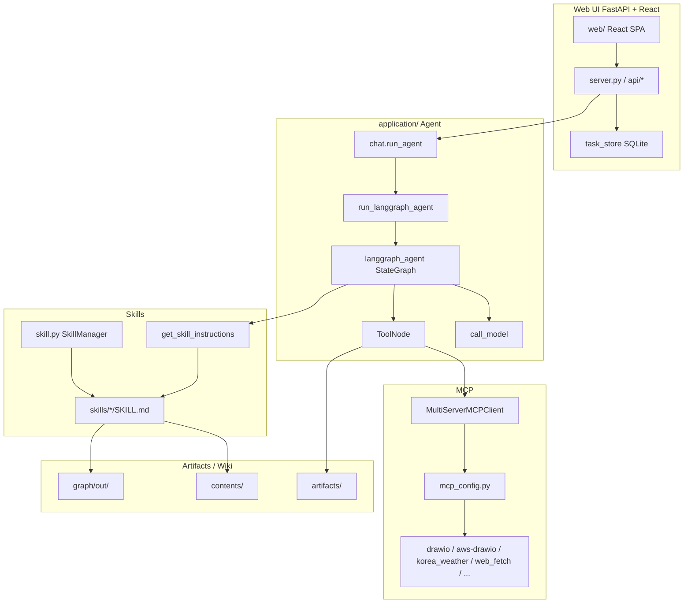
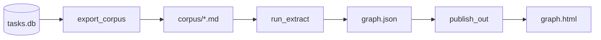

# Agent Wiki

[한국어](./README.md)

**Andrej Karpathy**, co-founder of OpenAI and former AI lead at Tesla, proposed querying data locally with an LLM Wiki built from structured Markdown. The idea is to explore and synthesize a local corpus as a **knowledge graph** without requiring RAG or a vector database.

**agent-wiki** turns that idea into a **web Agent + automatic Knowledge Graph**.

| What this project does | Description |
|------------------------|-------------|
| Conversational Agent | Chat via FastAPI + React UI with a LangGraph ReAct Agent (Skills · MCP · Bedrock/LiteLLM) |
| Knowledge accumulation | Persist chats, uploads, and `contents` docs as a turn corpus; extract entities and relations with an LLM |
| Knowledge Graph | Per-user `graph.json` / `graph.html` — Force Atlas · Neo4j Explore · Holistic View |
| Document search | Graph traversal (BFS/DFS) + source-body excerpts (no vector DB) |

You can still use vector search (RAG) in parallel, but the default knowledge path is **markdown wiki · graph traversal**.

### Core Loop

```
Raw data ingestion → LLM compiles & maintains wiki/graph → Query → Output saved back to wiki → Compound knowledge accumulation
```

| Item | Description |
|------|-------------|
| Storage format | Structured **Markdown files** (Obsidian-compatible) |
| Infrastructure | RAG pipeline not required; vector DB not required |
| Automation | Index, summaries, topic backlinks and communities |
| Linting | Detect inconsistencies; surface gaps that need new articles |
| Output formats | Markdown reports, Marp slides, Matplotlib charts, interactive graph HTML |
| Long-term vision | Synthetic data + fine-tuning → Internalize the corpus into model weights |

---

## Table of contents

1. [Overview](#overview)
2. [Operation Architecture](#operation-architecture)
3. [LLM Wiki vs RAG](#️-llm-wiki-vs-rag--when-to-use-which)
4. [graphify](#graphify) — corpus → graph pipeline
5. [Graph](#graph) — visualization patterns · pros/cons
6. [How to Search](#how-to-search) — `/graphify` CLI
7. [Document search](#document-search) — in-app Ask panel
8. [Message Trim](#message-trim)
9. [How to Run](#how-to-run)
10. [Execution Results](#execution-results)
11. [Reference](#reference)

---

## Overview

The Web UI is **FastAPI + React**. The Agent runs as **LangGraph in the same process** — no separate AgentCore Runtime is required for local use.

| Area | Path | Role |
|------|------|------|
| Web UI | `application/server.py`, `application/web/` | Task · Chat · Skill/MCP settings, SSE streaming |
| Agent | `application/chat.py` → `langgraph_agent.py` | LangGraph ReAct + MCP + Skills |
| Graph pipeline | `graph/` | tasks.db → corpus → LLM extract → `graph.html` |
| Graph API | `application/api/routes_graph.py`, `graph_query.py` | Serve HTML · document search · rebuild |
| Config | `application/config.json`, `mcp.list`, `skills.list` | Defaults for model · MCP · Skill · LiteLLM gateway |

```text
Browser (React :8501)
    │  REST + SSE (/api/...)
    ▼
FastAPI (application/server.py)
    │  chat.run_agent(...)
    ▼
LangGraph (langgraph_agent) + MCP + Skills + Bedrock / LiteLLM
```

### Main user flows

1. **Chat** — Create a Task, pick Skills/MCP, ask questions. Replies stream over SSE and land in `tasks.db`.
2. **Open Knowledge Graph** — Click the sidebar brand **Agent wiki (user)** → modal iframe loads `GET /api/graph` HTML.
3. **Switch pattern** — In the graph UI choose Force Atlas / Neo4j Explore / Holistic View → save `graph_pattern` in `settings.json` and re-render HTML only.
4. **Document search** — In the graph **Document search** panel, ask in natural language → related nodes + corpus body excerpts.
5. **Manual / incremental extract** — As chats accumulate, refresh corpus/graph via a background job or `graph/run_pipeline.py`.

### Directory layout (summary)

```text
agent-wiki/
├── application/          # FastAPI · LangGraph · React web · Skills
│   ├── server.py
│   ├── chat.py / langgraph_agent.py
│   ├── graph_query.py / graph_jobs.py
│   ├── api/routes_graph.py
│   └── web/              # React SPA
├── graph/                # Standalone Knowledge Graph pipeline
│   ├── run_pipeline.py
│   ├── export_corpus.py / run_extract.py / publish_out.py
│   └── lib/              # semantic, patterns, ask_panel, …
├── contents/             # Wiki / reference Markdown corpus
├── README.md / README_en.md
└── requirements.txt
```

Per-user session data (chat DB, graph corpus/out, settings) usually lives under session storage at `{user}/`. Graphs are published as `{user}/graph/out/graph.html`. See [graph/README.md](./graph/README.md) for path details.

## Operation Architecture



| Screen / feature | Description |
|------------------|-------------|
| Task Chat | Per-task session + SSE streaming (`chat.run_agent`). Pin, rename, delete |
| Skill / MCP | Pick Skills · MCP in the sidebar (defaults e.g. graphify, websearch, web_fetch) |
| File upload | Attach images · documents for the Agent |
| Knowledge Graph | Brand click → `KnowledgeGraphModal` → `/api/graph` |
| Settings | Knowledge Graph on/off, `graph_pattern`, and other user settings |

The Agent runs a ReAct loop with MCP tools and Skill instructions. Long chats use [Message Trim](#message-trim) so only the last N turns go to the LLM context.

---

## ⚖️ LLM Wiki vs RAG — When to Use Which?

| **LLM Wiki is better when** | **RAG is better when** |
|---|---|
| Complex questions spanning multiple documents | Large-scale data that changes in real time |
| Deep understanding and synthesis are required | Simple fact lookups |
| Expert-curated corpus | Source provenance tracking matters |
| Questions needing structural reasoning | You need rapid deployment |

> 💡 **Key analogy**: RAG is a database query; LLM Wiki is a second brain — complementary, not competing.

In agent-wiki you can run a **chat Agent (optional RAG MCP)** alongside **graph document search**. The graph path needs no embedding index: it walks `graph.json` and pulls raw-text excerpts.

## graphify

[graphify](https://github.com/safishamsi/graphify) turns a folder of code, documents, papers, images, video, and YouTube links into a queryable knowledge graph with a single `/graphify` command. It implements Karpathy’s `/raw` folder idea and shines at **batch folder extraction**.

Example upstream CLI artifacts:

```text
graphify-out/
├── graph.html       # Interactive graph (click nodes, search, filter by community)
├── GRAPH_REPORT.md  # God nodes, surprising connections, suggested questions
├── graph.json       # Persistent queryable graph
└── cache/           # SHA256 cache (only reprocesses changed files)
```

Install (upstream CLI / Skill):

```text
pip install graphifyy && graphify install
/graphify .   # Run on the current folder
```

Upstream graphify CLI pipeline:

```
detect() → extract() → build_graph() → cluster() → analyze() → report() → export()
```

### Role inside agent-wiki

This repo does not depend only on the Cursor `/graphify` skill. The standalone [`graph/`](./graph/) pipeline reads the Agent chat DB and builds **tasks.db → corpus → graph.json → HTML**. The orchestrator is [run_pipeline.py](./graph/run_pipeline.py).

- **`/graphify …` in chat**: The Skill builds or queries a graph from folders such as `contents/` (see Execution Results screenshots).
- **App Knowledge Graph**: Conversation turns are extracted automatically or manually into HTML you open from the sidebar, plus document search.



### corpus → graph extraction stages

| Stage | Script / module | LLM? | What it does |
|-------|-----------------|------|--------------|
| 1. Turn extraction | [tasks_db.py](./graph/lib/tasks_db.py) `build_turns` | No | Build user↔assistant **turn** pairs from SQLite |
| 2. Corpus export | [export_corpus.py](./graph/export_corpus.py) + [corpus.py](./graph/lib/corpus.py) | No | Write turns as YAML frontmatter + body `.md`. With `--user`, default is **delta** (changed only); SHA256 cache misses go to [extract_queue](./graph/lib/extract_queue.py) |
| 3. Semantic extraction | [run_extract.py](./graph/run_extract.py) → [semantic.py](./graph/lib/semantic.py) | **Yes** | Send corpus chunks (default 8 files) to the LLM for nodes/edges/hyperedges JSON. [llm.py](./graph/lib/llm.py) calls a LiteLLM gateway or Bedrock Converse |
| 4. Graph build | [build_graph.py](./graph/lib/build_graph.py) `build_and_export` | No | graphifyy `build_from_json` → Leiden/Louvain **cluster** → God nodes / surprising links → `graph.json` + `GRAPH_REPORT.md` |
| 5. HTML publish | [publish_out.py](./graph/publish_out.py) → [out_graphs.py](./graph/lib/out_graphs.py) / [patterns.py](./graph/lib/patterns.py) | No | Render `graph.json` as Force Atlas / Neo4j Explore / Holistic View HTML |

**Where relationships come from:** Leiden/Louvain only partition **communities**. Edges and confidence are produced by the stage-3 LLM as JSON.

| relation (examples) | Meaning |
|---------------------|---------|
| `references` / `calls` / `implements` / `cites` | Explicit reference, call, implement, cite |
| `conceptually_related_to` / `shares_data_with` | Conceptual or data relatedness |
| `semantically_similar_to` | Same problem without a structural link (usually INFERRED) |
| `rationale_for` | Design rationale → target concept |

| confidence | Meaning |
|------------|---------|
| EXTRACTED | Explicit in the source (score 1.0) |
| INFERRED | Inferred (typically 0.6–0.9); often dashed in HTML |
| AMBIGUOUS | Uncertain (0.1–0.3) |

### LLM settings (extraction)

1. **Preferred**: `llm_gateway_url` / `llm_gateway_key` in `application/config.json`
2. **Fallback**: env `LLM_GATEWAY_URL` / `LLM_GATEWAY_KEY`
3. **No gateway**: AWS Bedrock Converse (boto3 credentials). Model via `GRAPHIFY_LLM_MODEL`, etc. — details in [graph/README.md](./graph/README.md)

```bash
cd agent-wiki/graph
python -m pip install -r requirements.txt
python run_pipeline.py --user user01          # incremental: delta export + queue extract
python run_pipeline.py --user user01 --full   # rebuild corpus + re-extract uncached
# step by step
python export_corpus.py --user user01
python run_extract.py --from-queue           # or full: run_extract.py
python publish_out.py --user user01
```

From the app, enable Knowledge Graph in Settings and enqueue extraction with `POST /api/graph/rebuild` (`graph_jobs.py`, with cooldown and fingerprint skip).

For in-app visualization and document search, see [Graph](#graph) below.

### Supported files (upstream `/graphify` Skill)

- Code: .py, .ts, .js, .go, .rs, .java, .cpp, etc.
- Documents: .md, .txt, .docx, etc.
- Papers: .pdf
- Images: .png, .jpg, .webp (vision)
- Video/Audio: .mp4, .mp3, .wav (Whisper transcription)

The default input for the agent-wiki `graph/` pipeline is **conversation-turn markdown**. Folder-scale multimodal extraction uses the Skill/CLI `/graphify` path.

## Graph

`graph/` publishes `graph.json` from Agent chats and corpus as **vis-network** HTML. `patterns.py` renders the same data in three UI patterns; the choice is stored as `graph_pattern` in the user’s `settings.json`. Switching patterns **re-renders HTML only** — no re-extraction.

### Opening from the UI

```text
Sidebar "Agent wiki (user)" click
  → KnowledgeGraphModal + iframe
  → GET /api/graph  (session cookie user’s graph.html)
```

| API | Role |
|-----|------|
| `GET /api/graph` | Inline user graph HTML |
| `GET /api/graph/status` | Exists · job status · enabled |
| `POST /api/graph/rebuild` | Enqueue background pipeline |
| `POST /api/graph/query` | Document search (BFS/DFS + excerpt) |

If the graph is missing, a guidance page appears; reopen the modal after extraction finishes. If an older HTML lacks the document-search UI, the server may republish from `graph.json`.

| Pattern | Menu name | Implementation | Layout / visuals |
|---------|-----------|----------------|------------------|
| **pattern1** | Force Atlas | [pattern1_html.py](./graph/lib/pattern1_html.py) | `forceAtlas2Based`. Large `dot` nodes sized by degree, community-colored curved edges (`curvedCCW`), relation labels. INFERRED edges dashed. |
| **pattern2** | Neo4j Explore | [pattern2_html.py](./graph/lib/pattern2_html.py) | Neo4j Explore/Bloom style. Dark canvas, small `dot` nodes, thin gray continuous curves, hub-first labels. Physics: `barnesHut`. |
| **pattern3** | Holistic View | [pattern3_html.py](./graph/lib/pattern3_html.py) | Neo4j Browser-style full overview. `fit` on load. `ellipse` labeled nodes + uppercase relation edges. `forceAtlas2Based`. |

Shared UI: community legend filter, entity text search (label filter), node detail (source · relations), pattern switcher, **Document search** panel.

```text
graph.json (+ communities)
        │
        ▼
  patterns.write_pattern_html(pattern1|2|3)
        │
        ▼
  out/graph.html  ← Ask panel (ask_panel.py) injected
        │  POST /api/graph/query
        ▼
  application/graph_query.query_user_graph()
```

### Pattern traits, pros and cons

All three patterns share the **same `graph.json`**. The difference is what they make visible at a glance.

#### Force Atlas (pattern1)

`forceAtlas2Based` spreads communities; high-degree nodes grow larger; edges show community color + relation labels (INFERRED as dashed).

| Pros | Cons |
|------|------|
| Hub and community structure are intuitive | Dense graphs get cluttered with nodes/labels |
| Relation types and confidence visible on canvas | Force Atlas physics is relatively heavy |
| Balanced for exploration and explanation | Favors local structure over global terrain |

**Best for:** Explaining how concepts cluster and how they relate.

Force Atlas graph view:


#### Neo4j Explore (pattern2)

Explore/Bloom-style **small dots + thin gray curves**. Edge labels and arrows are mostly hidden; physics uses fast `barnesHut`.

| Pros | Cons |
|------|------|
| Terrain and clusters stay readable at large scale | Relation names/direction only via hover/detail |
| Low visual noise — easy to scroll and zoom | Hub size contrast is weak, so importance is harder to see |
| Stabilization and render are relatively light | Weak for explaining “who references whom” |

**Best for:** Scanning overall shape, density, and community layout of large graphs.

Neo4j Explore graph view:


#### Holistic View (pattern3)

Fits the full graph on load; `ellipse` labeled nodes plus uppercase relation names and arrows. Still Force Atlas, with strong overlap avoidance.

| Pros | Cons |
|------|------|
| Full overview and relation labels at once | Overlapping edge labels hurt readability fast |
| Close to Neo4j Browser “schema at a glance” | Label saturation when node/edge counts grow |
| Strong for relation-centric demos | Less clean terrain feel than Explore |

**Best for:** Mid-size graphs where you want one-screen summaries including relation kinds.

**One-liner:** structure/hubs → **Force Atlas**; scale/terrain → **Neo4j Explore**; relations at a glance → **Holistic View**.

Holistic View graph:


---

## How to Search

With the graphify **Skill** enabled in chat, you can ask the agent `/graphify …` style requests (same query / path / explain ideas as folder extract · CLI).

This is a different UI from **Document search** in the Knowledge Graph HTML. For the in-app panel, see [Document search](#document-search).

### 1️⃣ `/graphify query` - Search by Question

The most basic search method. Ask in natural language; the tool traverses the graph to answer.

```bash
# Default BFS traversal (broad search - "What is X connected to?")
/graphify query "How does RAG work?"

# DFS traversal (deep search - "How does X connect to Y?")
/graphify query "How does the auth module connect to the database?" --dfs

# Token budget limit (default 2000)
/graphify query "What is transformer architecture?" --budget 1500
```

| Mode | Characteristics | Best For |
|------|----------------|----------|
| **BFS** (default) | Broad traversal, starting from nearest nodes | "What is X?", "What is connected to X?" |
| **DFS** (`--dfs`) | Deep traversal, traces specific paths | "How does X connect to Y?" |


### 2️⃣ `/graphify path` - Find the Shortest Path Between Two Concepts

Finds the connection path between two nodes.

```bash
/graphify path "AuthModule" "Database"
/graphify path "RAG" "LLM"
```


### 3️⃣ `/graphify explain` - Explain a Specific Concept

Shows a detailed explanation and connections for a specific node (concept).

```bash
/graphify explain "SwinTransformer"
/graphify explain "RAG"
```

### Adding data

```bash
/graphify /Documents/Docs --update
```

### Adding PowerPoint files

Graphify does not support PowerPoint directly — convert to PDF first. LibreOffice example:

```bash
brew install --cask libreoffice
```

You can also ask in chat to convert a folder:

```bash
Convert the AgentAI ppts under /Downloads/Docs/AgenticAI to PDF. Skip if a PDF already exists.
```

---

## Document search

**Document search** in the graph HTML is separate from the top entity-name filter. Flow: question → related-node traversal → **source-file body excerpts** in one panel. Uses `graph.json` + raw files, with an optional **embedding hybrid** for start nodes (no vector DB — sidecar `out/node_embeddings.json`).

1. **UI** — [ask_panel.py](./graph/lib/ask_panel.py) CSS/HTML/JS is injected into all three pattern HTMLs. **Document search** → enter a question → `POST /api/graph/query` (`credentials: same-origin`).
2. **API** — [routes_graph.py](./application/api/routes_graph.py) resolves the session user’s `graph.json`, then calls `query_user_graph()` in [graph_query.py](./application/graph_query.py).
3. **Start-node matching** (lexical ∪ embedding)
   - Tokenize the question (English ≥3 chars, CJK ≥2).
   - Rank candidates by partial **label** match.
   - If labels miss (or to augment), score nodes whose `source_file` **body** contains query terms — e.g. English labels with a Korean query.
   - **Embeddings**: compare the question to node labels via LiteLLM `titan-embed-v2` (Bedrock Titan Text Embeddings V2, cosine ≥ 0.35) so synonyms like `날씨` ↔ `Weather` can seed traversal without a substring hit. Built on publish/`republish` into `out/node_embeddings.json`; lazy rebuild at query if missing/stale. Falls back to lexical-only when the gateway is unavailable.
4. **Graph traversal** — default **BFS** (depth 3), optional **DFS** (depth 6). Collect related nodes/edges, rank by relevance, truncate by token `budget`.
5. **Source excerpts** — read each matched node’s `source_file` only under allowed roots; show paragraphs overlapping query terms, labels, and `source_location`.
6. **Graph highlight** — raise opacity on result nodes; chip click `focus`es that node.

**Embedding config:** Document-search Titan embedding hybrid (vector search) runs only when `application/config.json` has **`hybrid_graph_search`: `"enable"`**. Any other value (or missing) → lexical only. Default in this repo is `"enable"`.

Gateway: with `llm_gateway_url` / `llm_gateway_key`, calls LiteLLM `titan-embed-v2`; otherwise Bedrock `amazon.titan-embed-text-v2:0`. Override with `GRAPHIFY_EMBEDDING_MODEL` / `GRAPHIFY_EMBEDDING_DIM`.

In-app document search reuses the same BFS/DFS/`budget` ideas as CLI `/graphify query` (CLI itself stays lexical). Pipeline and LLM settings: [graph/README.md](./graph/README.md).

Document search finds related nodes from start nodes:


And pulls related passages from the corpus:


---

## Message Trim

Keeps the LLM context bounded on long chats. The LangGraph agent (`call_model` in [application/langgraph_agent.py](./application/langgraph_agent.py)) keeps only the **last N HumanMessage turns** right before the LLM call. Messages in LangGraph state / the checkpointer stay intact; only the messages sent to the model are trimmed. Applies for both `history_mode=Enable` and `Disable`.

**Default:** `MAX_CONTEXT_TURNS = 5` (same “last 5 turns” intent as `SimpleMemory(k=5)` in plain chat)

**How to change:**

- Edit `MAX_CONTEXT_TURNS` in [application/langgraph_agent.py](./application/langgraph_agent.py)
- Or set `max_turns` / `configurable.max_turns` in the config from `create_agent()`
- `max_turns=0` disables trim

```python
# application/langgraph_agent.py
MAX_CONTEXT_TURNS = 5


def trim_messages_by_human_turns(messages: list, max_turns: int) -> list:
    """Keep messages from the last N HumanMessage turns (inclusive)."""
    if max_turns <= 0 or not messages:
        return messages

    human_indices = [i for i, msg in enumerate(messages) if isinstance(msg, HumanMessage)]
    if len(human_indices) <= max_turns:
        return messages

    return messages[human_indices[-max_turns]:]
```

In `call_model`, ToolMessage content is normalized, then trim runs:

```python
# application/langgraph_agent.py — inside call_model()
        max_turns = (
            config.get("configurable", {}).get("max_turns")
            or config.get("max_turns")
            or MAX_CONTEXT_TURNS
        )
        trimmed = trim_messages_by_human_turns(messages, max_turns)
        if len(trimmed) < len(messages):
            logger.info(
                f"trimmed messages from {len(messages)} to {len(trimmed)} "
                f"(max_turns={max_turns})"
            )
            messages = trimmed

        prompt = ChatPromptTemplate.from_messages([
            ("system", system),
            MessagesPlaceholder(variable_name="messages"),
        ])
        chain = prompt | model
        async for chunk in chain.astream({"messages": messages}):
            ...
```

`create_agent()` always passes `max_turns`, regardless of `history_mode`:

```python
# application/langgraph_agent.py — create_agent()
    if history_mode == "Enable":
        app = buildChatAgentWithHistory(tools)
        config = {
            "recursion_limit": 100,
            "configurable": {"thread_id": user_id},
            "tools": tools,
            "system_prompt": system_prompt,
            "max_turns": MAX_CONTEXT_TURNS,
        }
    else:
        app = buildChatAgent(tools)
        config = {
            "recursion_limit": 100,
            "configurable": {"thread_id": user_id},
            "tools": tools,
            "system_prompt": system_prompt,
            "max_turns": MAX_CONTEXT_TURNS,
        }
```

**What `max_turns=5` means**

- Keep **5 user HumanMessages** plus **all follow-up messages** in each turn
- One turn = one `HumanMessage` + subsequent `AIMessage`, `ToolMessage`, and tool feedback loops
- Multiple tool calls still count as **one turn** for the same user question

**Example (with tools)**

```
Human(Q1) → AI(tool_calls) → ToolMessage → AI(A1)
Human(Q2) → AI(A2)
Human(Q3) → AI(tool_calls) → ToolMessage → AI(A3)
```

With `max_turns=2`, keep from **Q2** onward:

```
Human(Q2) → AI(A2) → Human(Q3) → AI(tool_calls) → ToolMessage → AI(A3)
```

**vs trimming by message count**

| Approach | When `N=5` |
|----------|------------|
| Previous (message count) | Keep only 5 message objects → user-turn count becomes irregular because of tool loops |
| Current (HumanMessage turns) | Keep 5 user questions + full AI/Tool responses per turn |

**Relation to the checkpointer**

- With `history_mode=Enable`, `MemorySaver` still stores the **full** conversation.
- Trim is only for the LLM context window; it does not delete saved history.
- Logs show `trimmed messages from X to Y (max_turns=5)` when trim runs.

---

## How to Run

### Prerequisites

- Python 3.11+ recommended, Node.js (frontend build)
- (Optional) AWS credentials — Bedrock for chat and graph extraction
- (Optional) LiteLLM gateway URL/Key — `application/config.json`
- `graph/` pipeline: `cd graph && pip install -r requirements.txt` (graphifyy, etc.)

### Install and start

```bash
git clone https://github.com/kyopark2014/agent-wiki
cd agent-wiki && pip install -r requirements.txt

# Build frontend, then FastAPI on port 8501
./run_local.sh

# Or
cd application/web && npm install && npm run build && cd ../..
uvicorn application.server:app --host 0.0.0.0 --port 8501
```

Browser: [http://localhost:8501](http://localhost:8501)

- On first visit, enter a User ID; the session is kept via cookie.
- The Agent runs as **local LangGraph**, not AgentCore Runtime.
- For Knowledge Graph: accumulate chats, enable the feature in Settings, and run rebuild/pipeline if the graph is missing.

Frontend-only development:

```bash
cd application/web && npm run dev   # Vite :5173, /api → :8501 proxy
# other terminal
uvicorn application.server:app --host 0.0.0.0 --port 8501
```

---

## Execution Results

Running `/graphify contents/` builds a graph from files in the contents folder:


Then `/graphify query "How to transition from RAG to LLM Wiki?"` queries the graph:


Final answer example:


---

## Reference

[RAG Is Not Enough. Karpathy Just Showed Us What Comes Next.](./contents/rag_vs_llm_wiki_summary.md)

[What Karpathy's Second Brain Looks Like Inside a Real Business](./contents/karpathy_second_brain_in_business_summary.md)

[Andrej Karpathy let an agent run overnight on his own model.](./contents/karpathy_autoresearch_overnight_summary.md)

[Karpathy on AI Coding Agents](./contents/karpathy_ai_coding_agents_summary.md)

[Andrej Karpathy Just Redefined the "Second Brain", and It Has Massive Implications for Enterprise Innovation.](./contents/karpathy_second_brain_enterprise_summary.md)

[Karpathy's viral LLM Knowledge Base blueprint](./contents/karpathy_viral_llm_knowledge_base_blueprint_summary.md)

[safishamsi / graphify](https://github.com/safishamsi/graphify)

[graph/README.md](./graph/README.md) — pipeline, LLM, and session path details

[README.md](./README.md) — Korean
