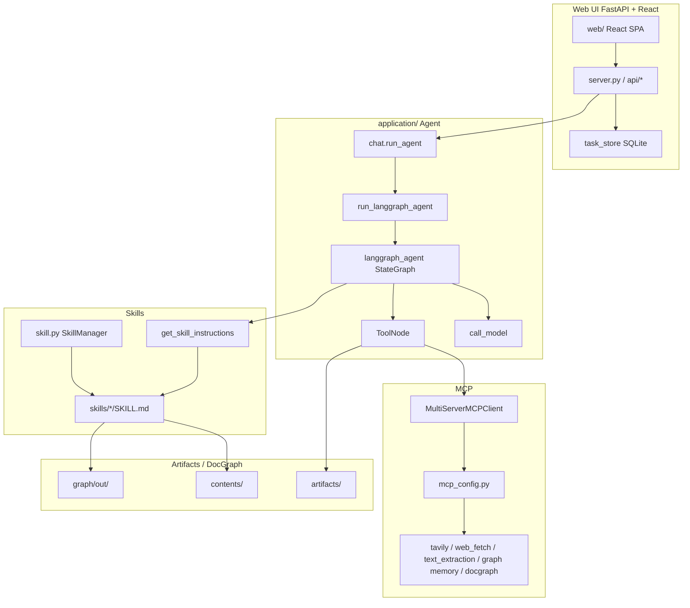
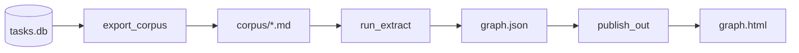

# DocGraph Intelligence

[English](./README.md)

AI application에서 사내의 중요한 문서를 활용하고자 한다면, 문서안의 그림과 표를 효과적으로 활용하기 위해 우수한 OCR 기능이 필요하고 Agnet를 이용해 활용성을 높여야 합니다. 여기에서는 OpenAI의 GPT모델이 가지는 높은 이미지분석 능력을 이용해 문서로 부터 충분한 정보를 text로 추출하고, 이를 knowledge graph로 구현하여 agent로 활용하는 방법을 설명합니다. Knowledge graph의 생성은 OpenAI 공동 창업자이자였던 **Andrej Karpathy**의 LLM Wiki의 개념을 활용하였고, 유사어 성능 향상을 위해 vector embedding을 이용하여 **docgraph**에 hybrid 검색을 구현하였습니다. Agent에서 파일을 업로드하면 multi modal parser를 이용해 OCR하고 knowledge graph를 추출합니다. 이후 사용자의 질문에 따라 MCP를 이용해 관련된 문서를 graph에서 가져오고, SKILL을 이용해 보고서를 생성할 수 있습니다. Agent framework로 한국에서 가장 많이 사용되고 있는 **LangGraph**를 이용하였고, Web UI는 **FastAPI + React**로 구현하였습니다.

아래는 DocGraph를 이용한 agent architecture입니다. VPC로 외부에서 접속이 안되도록 접근제어를 수행할 수 있고 Serverless인 ECS Fargate를 이용해 인프라 관리에 대한 부담없이 Agent를 구현하여 활용할 수 있습니다.


아래는 전체적인 시스템 구성에 대해 소개하고 있습니다. Browser에서 Web UI를 이용해 접속하고 LangGraph로 구현된 Agent에서 MCP/SKILL을 이용해 knowledge graph를 검색하고 활용할 수 있습니다. 

| 구분 | 경로 | 역할 |
|------|------|------|
| Web UI | `application/server.py`, `application/web/` | Task·Chat·Skill/MCP 설정, SSE 스트리밍 |
| Agent | `application/chat.py` → `langgraph_agent.py` | LangGraph ReAct + MCP + Skills |
| Graph 파이프라인 | `graph/` | tasks.db → corpus → LLM 추출 → `graph.html` |
| Graph API | `application/api/routes_graph.py`, `graph_query.py` | HTML 제공 · 문서검색 · rebuild |
| 설정 | `application/config.json`, `mcp.list`, `skills.list` | 모델·MCP·Skill·LiteLLM gateway 기본값 |

```text
Browser (React :8501)
    │  REST + SSE (/api/...)
    ▼
FastAPI (application/server.py)
    │  chat.run_agent(...)
    ▼
LangGraph (langgraph_agent) + MCP + Skills + OpenAI (LiteLLM gateway)
```


### 주요 사용 흐름

1. **채팅** — Task를 만들고 Skill/MCP를 고른 뒤 질문. 응답은 SSE로 스트리밍되며 `tasks.db`에 저장됩니다.
2. **Knowledge Graph 열기** — 사이드바 브랜드 **DocGraph (user)** 클릭 → 모달 iframe으로 `GET /api/graph` HTML 표시.
3. **패턴 전환** — 그래프 UI에서 Force Atlas / Neo4j Explore / Holistic View 선택 → `settings.json`의 `graph_pattern` 저장 후 HTML만 재생성.
4. **문서검색** — 그래프의 **문서검색** 패널에서 자연어 질문 → 관련 노드 + corpus 본문 excerpt.
5. **수동/증분 추출** — 대화가 쌓이면 백그라운드 job 또는 `graph/run_pipeline.py`로 corpus·그래프를 갱신.
6. **DocGraph Sync** — Settings → **DocGraph** → Configure / Sync / Graph 로 PDF·Sources를 그래프화 (`/api/docgraph/*`).

### 디렉터리 구조 (요약)

```text
docgraph-intelligence/
├── application/          # FastAPI · LangGraph · React web · Skills · MCP
│   ├── server.py
│   ├── chat.py / langgraph_agent.py
│   ├── graph_query.py / graph_jobs.py / docgraph_jobs.py
│   ├── api/routes_graph.py / routes_docgraph.py
│   ├── mcp_server_docgraph.py / mcp_server_graph_memory.py
│   └── web/              # React SPA
├── graph/                # Knowledge Graph + DocGraph Sync 파이프라인
│   ├── run_pipeline.py
│   ├── sync_docgraph.py
│   ├── export_corpus.py / run_extract.py / publish_out.py
│   └── lib/              # semantic, patterns, ask_panel, …
├── installer.py / uninstaller.py
├── README.md / README_kr.md
└── requirements.txt
```

사용자별 세션 데이터(대화 DB, Knowledge Graph, DocGraph, settings)는 `.session_storage/{user}/` 아래에 둡니다. Knowledge Graph는 `{user}/graph/out/graph.html`, DocGraph는 `{user}/docgraph/graphify-out/`입니다. 상세는 [Knowledge Graph](#knowledge-graph) · [DocGraph](#docgraph) · [graph/README.md](./graph/README.md)를 참고하세요.

## Operation Architecture



| 화면 / 기능 | 설명 |
|-------------|------|
| Task Chat | 태스크별 세션 + SSE 스트리밍 (`chat.run_agent`). 핀·이름 변경·삭제 지원 |
| Skill / MCP | 사이드바에서 Skill·MCP 선택 (기본 예: graphify, **tavily**, **graph memory**, **docgraph**) |
| 파일 업로드 | 이미지·문서 첨부 후 Agent에 전달 |
| Knowledge Graph | Settings → **Knowledge** → Graph, 또는 브랜드 클릭 → `KnowledgeGraphModal` → `/api/graph` |
| DocGraph | Settings → **DocGraph** → Sync / Graph / Configure |
| Settings | Knowledge On/Off·Sync, DocGraph Sync, `graph_pattern` 등 사용자 설정 |

Agent는 도구(MCP)·Skill 지시문을 받아 ReAct 루프로 동작합니다.


### DocGraph vs RAG 

| **DocGraph가 유리한 경우** | **RAG가 유리한 경우** |
|---|---|
| 여러 문서를 넘나드는 복잡한 질문 | 실시간으로 변하는 대규모 데이터 |
| 깊은 이해와 합성이 필요할 때 | 단순 사실 조회 |
| 전문가가 직접 큐레이션한 코퍼스 | 출처(provenance) 추적이 중요할 때 |
| 구조적 추론이 필요한 질문 | 빠른 배포가 필요할 때 |

docgraph-intelligence에서는 **채팅 Agent(MCP)** 와 **그래프 문서검색**을 함께 둡니다. (별도 RAG/KB 업로드는 제거됨) 그래프 쪽은 임베딩 인덱스 없이 `graph.json` 순회 + 원문 excerpt로 답을 보강합니다.


## Graph 

docgraph-intelligence에는 아래와 같이 대화 내용으로 부터 개인화된 추천과 같은 memory 기능을 제공하는 Knowledge Graph와 문서로 부터 정보를 가져오는 DocGraph가 있습니다. 입력·저장 위치·파이프라인이 다르며, 시각화 패턴(Force Atlas / Neo4j Explore / Holistic View)과 문서검색 UI는 공통으로 사용합니다.

| | **Knowledge Graph** | **DocGraph** |
|--|---------------------|----------------|
| 원본 | Agent 대화 (`tasks.db`) | `raw` / Sources / DocGraph 폴더 |
| 루트 | `.session_storage/{user}/graph/` | `.session_storage/{user}/docgraph/` |
| 산출 | `out/graph.html` · `graph.json` | `docgraph/graphify-out/app-graph.html` · `graph.json` |
| API | `GET /api/graph`, `POST /api/graph/query` | `GET /api/docgraph/graph`, `POST /api/docgraph/query` |
| 갱신 | Settings → **Knowledge** → Sync (`POST /api/graph/rebuild`) | Settings → DocGraph → **Sync** |
| 보기 | Settings → Knowledge → **Graph** / 브랜드 클릭 | Settings → DocGraph → **Graph** |
| Agent MCP | **`graph memory`** → `recall_graph_memory` | **`docgraph`** → `recall_docgraph` |


### Graph 활용

Knowledge Graph·DocGraph 모두 `graph.json`을 **vis-network** HTML로 publish합니다. 같은 그래프 데이터를 `patterns.py`가 세 가지 UI 패턴으로 렌더합니다. Knowledge Graph는 사용자 `settings.json`의 `graph_pattern`, DocGraph는 `graphify-out/.wiki_graph_pattern`에 저장됩니다. 패턴 전환 시 **재추출 없이 HTML만** 다시 생성합니다.


```text
Sidebar "DocGraph (user)" 클릭
  → KnowledgeGraphModal + iframe
  → GET /api/graph  (세션 쿠키의 graph.html)
```

| API | 역할 |
|-----|------|
| `GET /api/graph` | 사용자 그래프 HTML 인라인 표시 |
| `GET /api/graph/status` | 존재 여부 · job 상태 · enabled |
| `POST /api/graph/rebuild` | 백그라운드 파이프라인 enqueue |
| `POST /api/graph/query` | Knowledge Graph 문서검색 (BFS/DFS + excerpt) |
| `GET /api/docgraph/graph` | DocGraph HTML |
| `POST /api/docgraph/query` | DocGraph 문서검색 (동일 엔진) |

그래프가 아직 없으면 안내 HTML이 뜨고, 추출이 끝나면 모달을 다시 열면 됩니다. 구버전 HTML에 문서검색 UI가 없으면 서버가 `graph.json`으로부터 republish를 시도합니다.

| 패턴 | 메뉴 이름 | 구현 | 레이아웃 / 비주얼 |
|------|-----------|------|-------------------|
| **pattern1** | Force Atlas | [pattern1_html.py](./graph/lib/pattern1_html.py) | `forceAtlas2Based`. degree에 비례한 큰 `dot` 노드, 커뮤니티 컬러 곡선 엣지(`curvedCCW`), 관계 라벨. INFERRED는 점선. |
| **pattern2** | Neo4j Explore | [pattern2_html.py](./graph/lib/pattern2_html.py) | Neo4j Explore/Bloom 스타일. 어두운 캔버스, 작은 `dot` 노드, 얇은 회색 연속 곡선 엣지, 허브 위주 라벨. physics는 `barnesHut`. |
| **pattern3** | Holistic View | [pattern3_html.py](./graph/lib/pattern3_html.py) | Neo4j Browser식 전체 overview. 로드 직후 `fit`. `ellipse` 라벨 노드 + 관계명(대문자) 엣지. `forceAtlas2Based`. |

공통 UI: 그룹(커뮤니티) 범례 필터, 좌상단 **문서검색**(Enter로 쿼리, 검색창·결과가 하나의 카드), 노드 클릭 상세(출처·관계), 패턴 전환 버튼.

```text
graph.json (+ communities)
        │
        ▼
  patterns.write_pattern_html(pattern1|2|3)
        │
        ▼
  out/graph.html  ← Ask panel (ask_panel.py) 삽입
        │  POST /api/graph/query
        ▼
  application/graph_query.query_user_graph()
```

### Graphify T-Box

**Graphify**의 T-Box는 `extract.py` 소스 코드 안에 하드코딩된 엣지 타입(relation 값) 집합입니다. OWL/RDF와 다르게 미리 정의된 edge type을 아래와 같이 활용합니다.

```
Graphify T-Box 위치:
  graphify/extract.py 내부의 add_edge() 호출부
      ↓
  "relation": "calls" | "imports" | "contains" | "inherits" | ...
```


#### 코드 분석용 엣지 타입 (AST 기반 — `EXTRACTED`)

| 엣지 타입 | 신뢰도 | 의미 | 예시 |
|---|---|---|---|
| `contains` | EXTRACTED | 파일이 클래스/함수를 포함 | `auth.py` → `DigestAuth` |
| `imports` | EXTRACTED | 파일이 모듈을 임포트 | `main.py` → `requests` |
| `imports_from` | EXTRACTED | 파일이 특정 모듈에서 임포트 | `auth.py` → `models` |
| `inherits` | EXTRACTED | 클래스가 부모 클래스를 상속 | `DigestAuth` → `Auth` |
| `method` | EXTRACTED | 클래스가 메서드를 보유 | `DigestAuth` → `.authenticate()` |

#### 코드 분석용 엣지 타입 (Call Graph — `INFERRED`)

| 엣지 타입 | 신뢰도 | 의미 | 예시 |
|---|---|---|---|
| `calls` | INFERRED | 함수/메서드가 다른 함수를 호출 | `.authenticate()` → `.hash()` |
| `uses` | INFERRED | 크로스파일 임포트 해석 | `DigestAuth` → `Response` |

#### 문서/이미지/PDF용 엣지 타입 (LLM 시맨틱 분석)

문서 처리는 LLM(OpenAI GPT)이 자유 형식으로 엣지를 생성하는데, 아래는 LLM이 판단하는 의미 관계입니다.

| 엣지 타입 | 예시 |
|---|---|
| `references` | 논문A가 논문B를 인용 |
| `explains` | 문서가 개념을 설명 |
| `depends_on` | 모듈이 다른 모듈에 의존 |
| `defines` | 파일이 개념을 정의 |
| 기타 자유형식 | LLM이 문맥에서 판단 |

#### 신뢰도 태그 (Confidence Labels)

| 태그 | 의미 |
|---|---|
| `EXTRACTED` | 소스에서 **직접 확인된** 사실 (import 구문, class 선언 등) |
| `INFERRED` | **합리적 추론** (call graph, 공동 출현) |
| `AMBIGUOUS` | **불확실** — GRAPH_REPORT.md에서 검토 필요 |

신뢰도 태그는 Graphify에서 정의한 신뢰도 메타데이터라는 개념을 이용합니다.


#### T-Box와 A-Box의 분리 방식

```
Graphify T-Box                    Graphify A-Box
────────────────────              ───────────────────────────────────
"relation" 값 집합                 graph.json의 실제 nodes + edges

contains                           DigestAuth --contains--> .authenticate()
imports                            auth.py --imports_from--> models
imports_from                       httpx.py --imports--> ssl
inherits                           BasicAuth --inherits--> AuthBase
method                             Client --method--> .send()
calls       (INFERRED)             .build_request() --calls--> .encode()
uses        (INFERRED)             DigestAuth --uses--> Response
```

#### Graphify T-Box vs 다른 도구 비교

| 구분 | **Graphify** | **Graphiti** | **OWL/RDF** |
|---|---|---|---|
| **T-Box 위치** | `extract.py` 코드 내 하드코딩 | Pydantic 모델 파일 | `.ttl` / `.owl` 파일 |
| **T-Box 커스터마이즈** | ❌ 소스 수정 필요 | ✅ Pydantic 모델 정의 | ✅ 완전 자유 |
| **신뢰도 태깅** | ✅ EXTRACTED/INFERRED/AMBIGUOUS | ❌ (temporal validity로 대체) | ❌ |
| **도메인 추론** | ❌ | ❌ | ✅ HermiT/Pellet |
| **업데이트 방식** | `--update` (A-Box만) | `add_episode()` 실시간 | 트리플스토어 직접 수정 |
| **T-Box 안정성** | 버전 업에서만 변경 | 언제든 변경 가능 | 언제든 변경 가능 |
| **주요 목적** | 코드/문서 구조 이해 | AI 에이전트 메모리 | 시맨틱 웹 표준 |


### graph.json 생성 및 활용

아래와 같이 graph.json을 생성고 활용합니다.

① 넣는 방법: graphify . 실행 → 파일 자동 분석 → graph.json 생성
② 업데이트:  graphify . --update → 변경된 파일만 SHA256 체크 후 증분 머지
③ 활용:      graphify query / path / explain 또는 graph.json 직접 Python 분석

```
┌─────────────────────────────────────────────────────┐
│                   graph.json                        │
│                                                     │
│  T-Box: "relation" 값 종류                            │
│         (calls, contains, inherits ...)             │
│                                                     │
│  A-Box: 실제 인스턴스 데이터                             │
│         nodes: [{id, label, file_type, ...}]        │
│         links: [{source, target, relation, ...}]    │
└─────────────────────────────────────────────────────┘
```


### Graph Pattern

아래의 패턴들은 **같은 `graph.json`**을 쓰며, 차이점은 “무엇을 한눈에 보이게 하느냐”입니다. 또한 graph를 통해 node, edge의 관게를 확인하고 isolated graph의 숫자 통해 graph 생성이 잘되었는지 확인할 수 있습니다.

#### Force Atlas (pattern1)

`forceAtlas2Based`로 커뮤니티가 벌어지고, degree가 큰 노드는 크게 보이며 엣지는 커뮤니티 컬러 + 관계 라벨(INFERRED는 점선)을 표시합니다.

| 장점 | 단점 |
|------|------|
| 허브·커뮤니티 구조가 직관적 | 노드·라벨이 많아 밀집 그래프에서 번잡 |
| 관계 종류·신뢰도를 캔버스에서 바로 확인 | Force Atlas 계산이 상대적으로 무거움 |
| 탐색·설명용으로 균형이 좋음 | “전체 지형”보다 “국소 구조” 중심 |

**적합:** 개념이 어떻게 묶이고 어떤 관계인지 설명할 때.

Force atlas로 보여주는 graph 화면입니다.


#### Neo4j Explore (pattern2)

Explore/Bloom 느낌의 **작은 점 + 얇은 회색 곡선**. 엣지 라벨·화살표는 거의 숨기고, physics는 빠른 `barnesHut`입니다.

| 장점 | 단점 |
|------|------|
| 대규모에서도 지형·클러스터가 잘 보임 | 관계명·방향은 hover/상세로만 확인 |
| 시각 노이즈가 적어 스크롤·줌이 편함 | 허브 크기 차이가 작아 중요도 파악이 약함 |
| 안정화·렌더가 비교적 가벼움 | “누가 누구를 참조하는지” 설명에는 약함 |

**적합:** 큰 그래프의 전체 모양·밀도·커뮤니티 분포를 훑을 때.

Neo4j explore로 보여주는 graph 화면입니다.


#### Holistic View (pattern3)

로드 직후 `fit`으로 전체를 담고, `ellipse` 라벨 노드 + 관계명(대문자)·화살표를 표시합니다. Force Atlas이지만 overlap 회피를 강하게 잡습니다.

| 장점 | 단점 |
|------|------|
| 전체 overview + 관계 라벨을 동시에 보여줌 | 엣지 라벨이 겹치면 가독성이 급격히 떨어짐 |
| Neo4j Browser식 “스키마 한눈에”에 가까움 | 노드 수·엣지 수가 많으면 글자가 포화 |
| 관계 중심 설명·데모에 유리 | Explore만큼 깔끔한 지형감은 약함 |

**적합:** 중간 규모에서 관계 종류까지 포함한 한 장 요약을 보여줄 때.

**한 줄 요약:** 구조·허브 → **Force Atlas**, 규모·지형 → **Neo4j Explore**, 관계 라벨까지 한눈에 → **Holistic View**.

Holistic view의 graph 화면입니다.


### Knowledge Graph

**채팅 대화**에서 엔티티·관계를 뽑아, 사이드바 브랜드 클릭 시 모달로 보는 그래프입니다. Cursor `/graphify` Skill에만 의존하지 않고, [`graph/`](./graph/) 단독 파이프라인이 **tasks.db → corpus → graph.json → HTML**을 만듭니다. 오케스트레이터는 [run_pipeline.py](./graph/run_pipeline.py)입니다.

#### 폴더 위치

| 역할 | 경로 |
|------|------|
| 파이프라인 코드 | `docgraph-intelligence/graph/` (`run_pipeline.py`, `export_corpus.py`, …) |
| 사용자 작업 공간 | `{SESSION_STORAGE}/.session_storage/{user}/graph/` |
| Corpus | `…/graph/corpus/*.md` |
| 산출물 | `…/graph/out/graph.json`, `graph.html` (+ `GRAPH_REPORT.md`, `node_embeddings.json`) |
| 입력 DB | `tasks.db` (Agent 대화) |

예: `{user}/graph/out/graph.html` → `GET /api/graph`

#### 생성 과정



```text
tasks.db
  → export_corpus   (turn → corpus/*.md, SHA256 캐시·delta)
  → run_extract     (LLM 시맨틱 추출 → nodes/edges)
  → build_graph     (cluster → graph.json + GRAPH_REPORT.md)
  → publish_out     (pattern1/2/3 → graph.html + 문서검색 패널)
```

| 단계 | 스크립트 / 모듈 | LLM? | 하는 일 |
|------|-----------------|------|---------|
| 1. Turn 추출 | [tasks_db.py](./graph/lib/tasks_db.py) `build_turns` | 없음 | SQLite에서 user↔assistant **turn** 쌍을 만듦 |
| 2. Corpus 내보내기 | [export_corpus.py](./graph/export_corpus.py) + [corpus.py](./graph/lib/corpus.py) | 없음 | turn을 YAML frontmatter + 본문 `.md`로 저장. `--user` 기본은 **delta**(변경분만) + SHA256 캐시 miss를 [extract_queue](./graph/lib/extract_queue.py)에 적재 |
| 3. 시맨틱 추출 | [run_extract.py](./graph/run_extract.py) → [semantic.py](./graph/lib/semantic.py) | **있음** | corpus chunk(기본 8파일)를 LLM에 넘겨 nodes/edges/hyperedges JSON 추출. LLM은 [llm.py](./graph/lib/llm.py)가 LiteLLM gateway 또는 Bedrock Converse로 호출 |
| 4. 그래프 빌드 | [build_graph.py](./graph/lib/build_graph.py) `build_and_export` | 없음 | graphifyy `build_from_json` → Leiden/Louvain **cluster** → God Node·놀라운 연결 분석 → `graph.json` + `GRAPH_REPORT.md` |
| 5. HTML publish | [publish_out.py](./graph/publish_out.py) → [out_graphs.py](./graph/lib/out_graphs.py) / [patterns.py](./graph/lib/patterns.py) | 없음 | `graph.json`을 Force Atlas / Neo4j Explore / Holistic View HTML로 렌더 |

**관계가 만들어지는 지점:** Leiden/Louvain은 **커뮤니티만** 나눕니다. 엣지와 confidence는 3단계 LLM이 JSON으로 명시한 결과입니다.

| relation (예) | 의미 |
|---------------|------|
| `references` / `calls` / `implements` / `cites` | 명시적 참조·호출·구현·인용 |
| `conceptually_related_to` / `shares_data_with` | 개념·데이터 관련 |
| `semantically_similar_to` | 구조 링크 없이 같은 문제 (보통 INFERRED) |
| `rationale_for` | 설계 이유 → 대상 개념 |

| confidence | 의미 |
|------------|------|
| EXTRACTED | 원문에 드러남 (score 1.0) |
| INFERRED | 추론 (보통 0.6–0.9) · HTML에서 점선으로 표시되는 경우 있음 |
| AMBIGUOUS | 불확실 (0.1–0.3) |


### DocGraph

Settings → DocGraph → **Sync** (`docgraph_jobs.py` 백그라운드)로 DocGraph를 생성합니다. 시각화 패턴·문서검색은 아래 [Graph](#graph)를 참고하세요. 채팅 Agent에서 DocGraph 코퍼스를 검색하려면 Settings → MCP에서 **`docgraph`** 를 켭니다. 도구 `recall_docgraph`는 `POST /api/docgraph/query`와 같은 `query_user_graph()` 경로를 사용합니다. 자세한 내용은 [Agent MCP (graph memory · docgraph)](#agent-mcp-graph-memory--docgraph)를 보세요.


#### 핵심 루프 (Core Loop)

```
원시 데이터 투입 → LLM이 위키·그래프 컴파일·유지 → 쿼리 → 출력물 다시 위키에 저장 → 지식 복리 축적
```

| 항목 | 내용 |
|------|------|
| 저장 형식 | 구조화된 **Markdown 파일** (Obsidian 호환 가능) |
| 인프라 | RAG 파이프라인 필수 아님, 벡터 DB 필수 아님 |
| 자동 기능 | 인덱스, 요약, 토픽 간 백링크·커뮤니티 유지 |
| 린팅(Linting) | 불일치 감지, 새 아티클 필요 갭 자동 발굴 |
| 출력 형식 | Markdown 리포트, Marp 슬라이드, Matplotlib 차트, 인터랙티브 graph HTML |
| 장기 비전 | 합성 데이터 생성 + 파인튜닝 → 모델 가중치에 코퍼스 내재화 |


#### 폴더 위치

| 역할 | 경로 |
|------|------|
| DocGraph 루트 | `.session_storage/{user}/docgraph/` (로그인 사용자별) |
| Inbox | `{docgraph}/raw/` — 넣고 싶은 원본을 모음 |
| Sources | Settings → DocGraph → Configure (최대 3개, `{docgraph}/wiki_sources.json`) |
| 산출물 디렉터리 | `{docgraph}/graphify-out/` |
| 앱용 HTML | `graphify-out/app-graph.html` → `GET /api/docgraph/graph` |
| JSON | `graphify-out/graph.json` |

```text
application/.session_storage/{user}/docgraph/
├── raw/                   # 논문·노트·PDF·URL 수집본 (inbox)
├── wiki_sources.json      # Sync Sources · URL 이력 (사용자별)
└── graphify-out/
    ├── converted/         # PDF/Office → markdown 변환본
    ├── graph.json
    ├── GRAPH_REPORT.md
    ├── app-graph.html     # 앱 DocGraph UI
    └── cache/             # SHA256 캐시 (변경된 파일만 재처리)
```

> **Note:** Upstream graphify `detect()`는 기본적으로 **Source 폴더 옆**에 `{source}/graphify-out/converted`를 만듭니다. DocGraph Sync는 이를 **해당 사용자의** `{docgraph}/graphify-out/converted`로 옮긴 뒤, PDF 등 시맨틱용 마크다운도 같은 곳에 둡니다. Source 옆 `graphify-out`은 Sync 산출물이 아닙니다.

#### 생성 과정

```text
Sources / raw (없으면 DocGraph 루트)
  → detect (증분이면 소스 폴더별 mtime diff → 신규/변경만; Source+raw 다중 폴더도 증분)
  → AST 추출 (코드)
  → 시맨틱 추출 (.md; pdf/txt는 md로 변환 후)
  → build + cluster
  → graphify-out/graph.json · GRAPH_REPORT.md
  → republish → app-graph.html (Force Atlas / Neo4j / Holistic)
```

증분 Sync는 `graph.json` + `manifest.json`이 있으면 Source 개수와 무관하게 **변경·신규 파일만** 재추출합니다. Foundation Model Parser를 나중에 켜도 이미 처리된 PDF는 다시 돌리지 않고, 새로 추가된 파일만 현재 파서 설정을 씁니다. 전체 재처리는 Sync의 full 모드가 필요할 때입니다.
업스트림 graphify CLI 파이프라인(동일 계열):

```
detect() → extract() → build_graph() → cluster() → analyze() → report() → export()
```

설치 (업스트림 CLI / Skill용):

```text
pip install graphifyy && graphify install
/graphify .   # 현재 폴더에 실행
```

#### 문서의 추가 (`raw` · Sources)

DocGraph용 원본은 **`raw` 입력함(inbox)** 에 모읍니다. `raw`는 Sync가 자동 생성하는 폴더가 아니라, **넣고 싶은 코퍼스를 모아 두는 곳**입니다.

Settings → DocGraph → Sync는 `raw/`가 있으면 그 폴더를, 없으면 DocGraph 루트 전체를 추출합니다. Sources를 Configure에서 지정하면 해당 폴더(최대 3개)를 추출합니다.

#### `raw`의 용도

- 논문·노트·스크린샷·코드·PDF 등 **그래프에 넣고 싶은 원본**을 두는 폴더
- 직접 복사·이동하거나, `/graphify add <url>`로 URL을 받아 `./raw`에 저장
- Sync / `/graphify`가 이 폴더(또는 지정 경로)를 읽어 `graphify-out/`에 그래프를 만듦

예: `/document/doc/doc01.pdf`만 있는 경우

`raw`에 자동으로 들어오지 않습니다.

| 하는 일 | `raw`에 생기는 것 |
|---------|-------------------|
| 아무것도 안 함 | 없음 |
| 파일을 `{docgraph}/raw/`로 복사·이동 | `doc01.pdf` (넣은 그대로) |
| `/graphify /document/doc` | `raw`가 아니라 **그 경로를 직접** 추출 (raw에 복사본을 만들지 않음) |
| `/graphify add <url>` | 받은 내용이 `./raw`에 저장됨 |

앱에서는 Settings → DocGraph → **Configure**로 Sync **Sources**를 최대 3개까지 지정하고(Source 선택 시 폴더 메뉴), URL은 입력 시 바로 해당 사용자의 `{docgraph}/raw`에 저장합니다. URL 이력·Sources는 `{docgraph}/wiki_sources.json`에 저장됩니다. **Sync** 후 **Graph**로 결과를 봅니다.

시맨틱 단계는 `.md`를 입력으로 쓰므로, Source의 `.pdf`/`.txt`는 Sync 시 텍스트 마크다운으로 변환한 뒤 추출합니다(이미지는 vision 미지원으로 skip).

#### URL 리소스 수집 방식

Configure에서 URL을 **추가하는 순간** `graphify.ingest`가 HTTP(S)로 리소스를 가져와 해당 사용자의 `{docgraph}/raw`에 저장합니다. Sync는 URL을 다시 fetch하지 않고, 이미 `raw`에 있는 파일(+설정된 폴더)만 추출합니다.

| URL 유형 | 동작 |
|----------|------|
| 일반 웹페이지 | HTML을 받은 뒤 `html2text`로 마크다운 `.md`로 변환해 저장 |
| PDF / 이미지 | 바이너리로 그대로 다운로드 |
| tweet / arXiv / YouTube / GitHub 등 | 타입별 분기 (oEmbed, 초록, 오디오 등) |

구현은 브라우저 자동화(Playwright 등)가 아니라 **서버 측 HTTP fetch + HTML→마크다운 변환**입니다 (`urllib` 기반 `safe_fetch`). http/https만 허용하고, private IP·클라우드 메타데이터 엔드포인트는 차단합니다. JavaScript로만 렌더링되는 사이트는 본문이 거의 안 잡힐 수 있습니다.

#### 지원 파일 (업스트림 /graphify Skill 기준)

- Code: .py, .ts, .js, .go, .rs, .java, .cpp, etc.
- Documents: .md, .txt, .docx, etc.
- Papers: .pdf
- Images: .png, .jpg, .webp (vision 분석 — CLI/Skill; 앱 DocGraph Sync는 이미지 skip)
- Video/Audio: .mp4, .mp3, .wav (Whisper 전사)


#### 마크다운 파일 생성 (Extract)

시맨틱 추출은 **마크다운(또는 일반 텍스트)** 을 입력으로 씁니다. 타입마다 변환 시점이 다르며, 앱 DocGraph Sync는 [`graph/sync_docgraph.py`](./graph/sync_docgraph.py)가 담당합니다. 코드는 md로 바꾸지 않고 AST만 추출합니다.

```text
Sources / raw
  → detect()          # 분류 + Office(.docx/.xlsx) → md sidecar
  → [DocGraph Sync] relocate → {docgraph}/graphify-out/converted/
  → AST extract       # 코드만 (md 변환 없음)
  → semantic extract  # 문서/논문: md로 stage 후 LLM 추출, stage PDF/txt/md → converted/      
  → merge → graph.json
```

| 유형 | 변환 | 구현 | DocGraph Sync |
|------|------|------|-----------|
| **Code** (.py, .ts, .js, .go, …) | md 변환 없음 · AST 추출 | `graphify.extract` | 동일 |
| **.md / .txt / .rst** | 그대로 stage (길면 ~10KB 청크) | `_doc_to_markdown_body` / `_stage_docs_as_markdown` | `converted/{name}.md` 또는 `{stem}_partNN.md` |
| **.docx / .xlsx** | `detect()` 시 Office→md | `graphify.detect.convert_office_file` (python-docx / openpyxl) | Source 옆 sidecar를 DocGraph `converted/`로 relocate |
| **.pdf** | 페이지 텍스트 → md 래핑 (기본 pdfplumber/pypdf; Foundation Model Parser On 시 PDF→이미지→LLM) | [`graph/pdf2text.py`](./graph/pdf2text.py) | `# stem` + `## Page N` 형태로 stage |
| **이미지** (.png, .jpg, .webp) | CLI/Skill: vision으로 직접 이해 (사전 md 변환 아님) | Skill 시맨틱 서브에이전트 | **skip** |
| **Video/Audio** | Whisper → `.txt` → docs로 취급 | `graphify.transcribe` (faster-whisper) | Sync **미지원** |
| **URL (웹페이지)** | 수집 시점 HTML→md | `graphify.ingest` (`html2text`) | `raw/*.md`에 저장 · Sync는 재fetch 안 함 |


**Documents (.md / .txt)** `_doc_to_markdown_body`가 UTF-8로 읽고, `_stage_docs_as_markdown`이 `{docgraph}/graphify-out/converted/`에 씁니다. 짧은 `.md`(≤12KB)는 파일명 그대로 복사하고, 긴 문서는 약 10,000자 단위 청크하여 `{stem}_part01.md` … + YAML frontmatter (`source_file`, `chunk`)로 저장합니다.

**Office:** Heading→`#`/`##`, 리스트→`-`, 표·엑셀 시트→마크다운 테이블. 파일명은 `{stem}_{pathHash8}.md`이며 detect 목록에는 원본이 아니라 이 sidecar가 들어갑니다. (docx: `python-docx`, xlsx: `openpyxl`)

#### Papers (.pdf) — Sync 스테이징

기본(Foundation Model Parser **Off**): `_pdf_to_text` → [`graph/pdf2text.py`](./graph/pdf2text.py)의 classical 경로

1. **pdfplumber**로 페이지별 텍스트 → `## Page N`
2. 실패 시 **pypdf**

DocGraph Configure에서 **Foundation Model Parser**를 **On**하면 (기본 Off) rag-multimodal과 같은 멀티모달 경로를 씁니다.

1. **PyMuPDF**로 페이지 PNG 렌더 (`page_001.png` …) → `{wiki}/graphify-out/converted/.pdf_pages/{stem}_{hash}/pages/`
2. 각 이미지를 멀티모달 LLM(OpenAI/gateway)으로 Markdown 변환 (`mcp_server_text_extraction` · img2text 프롬프트)
3. **페이지마다** `.pdf_pages/.../extracted.md`에 `## Page N`을 append(+fsync). Sync가 중간에 끊겨도 다음 Sync에서 이어서 처리(이미 끝난 페이지·PNG는 skip)
4. 전부 끝나면 `converted/{stem}.md`(또는 `_partNN.md`)로 stage. 실패 시(부분 md 없을 때만) classical(pdfplumber/pypdf)로 fallback

그다음 아래 형태로 `converted/`에 stage한 뒤 `extract_corpus`에 넘깁니다.

```text
# {파일명stem}

Source: `{원본경로}`

## Page 1
…
```

긴 PDF는 Documents와 같이 ~10KB 청크(`{stem}_partNN.md`) + YAML frontmatter(`source_file`, `chunk`)로 나눕니다. 추출 후 `_rewrite_extract_sources`가 노드·엣지의 `source_file`을 다시 **원본 PDF 경로**로 되돌립니다. 변환본은 디버깅용으로 `{docgraph}/graphify-out/converted/`에 남습니다.

업스트림 CLI/Skill은 PDF를 바이너리로 두고 서브에이전트가 읽게 할 수 있지만, 앱 Sync는 반드시 텍스트 md로 먼저 바꿉니다.


### Graph 추출

그래프는 **구조 추출(AST)** 과 **시맨틱 추출(LLM)** 을 합쳐 만듭니다. 관계는 Leiden/Louvain이 만들어 주지 않고, LLM·AST가 edge JSON으로 명시한 뒤 그 위에서만 커뮤니티를 나눕니다.

| 경로 | 대상 | 구현 | LLM? |
|------|------|------|------|
| **AST** | 코드 (.py, .ts, .go, …) | `graphify.extract` | 없음 (import·호출 등 결정적) |
| **시맨틱** | 문서·논문 (.md 스테이징 후) | DocGraph Sync: [`graph/lib/semantic.py`](./graph/lib/semantic.py) · Skill: 서브에이전트 | 있음 |

```text
detect → AST extract + semantic extract (병렬 가능)
  → merge (.graphify_extract.json)
  → build_from_json → cluster → graph.json / GRAPH_REPORT.md / HTML
```

- **DocGraph Sync / Knowledge Graph 파이프라인:** Cursor `/graphify` Skill 대신 LiteLLM gateway(OpenAI)가 `EXTRACT_SYSTEM` 프롬프트로 청크별 JSON을 뽑습니다. chunk 크기는 Skill(20–25)보다 작은 **8**입니다.
- **Cursor `/graphify` Skill:** 동일 스키마의 서브에이전트 프롬프트를 청크마다 병렬 디스패치합니다. (이미지 vision·영상 Whisper는 Skill/CLI만)

#### 시맨틱 추출 프롬프트

소스: [`graph/lib/semantic.py`](./graph/lib/semantic.py) (`EXTRACT_SYSTEM` + `extract_chunk`). 업스트림 [graphify Skill](https://github.com/safishamsi/graphify) Part B와 동일 계열입니다.

**System prompt (`EXTRACT_SYSTEM`):**

```python
EXTRACT_SYSTEM = """You are a graphify extraction agent. Read the documents and extract a knowledge graph fragment.
Output ONLY valid JSON matching the schema - no explanation, no markdown fences, no preamble.

Rules:
- EXTRACTED: relationship explicit in source (import, call, citation, "see §3.2")
- INFERRED: reasonable inference (shared data structure, implied dependency)
- AMBIGUOUS: uncertain - flag for review, do not omit

Doc files: extract named concepts, entities, citations. Also extract rationale — sections that explain WHY a decision was made, trade-offs chosen, or design intent. These become nodes with `rationale_for` edges pointing to the concept they explain.

Semantic similarity: if two concepts solve the same problem without structural link, add `semantically_similar_to` (INFERRED, confidence_score 0.6-0.95).

Hyperedges: if 3+ nodes clearly participate together beyond pairwise edges, add up to 3 hyperedges.

If a file has YAML frontmatter (--- ... ---), copy source_url, captured_at, author, contributor onto every node from that file.
Also copy user_id from frontmatter into author when author is null.

confidence_score is REQUIRED on every edge:
- EXTRACTED: always 1.0
- INFERRED: 0.6-0.9 typically
- AMBIGUOUS: 0.1-0.3

Output exactly this JSON shape:
{"nodes":[{"id":"filestem_entityname","label":"Human Readable Name","file_type":"document","source_file":"relative/path","source_location":null,"source_url":null,"captured_at":null,"author":null,"contributor":null}],"edges":[{"source":"node_id","target":"node_id","relation":"calls|implements|references|cites|conceptually_related_to|shares_data_with|semantically_similar_to|rationale_for","confidence":"EXTRACTED|INFERRED|AMBIGUOUS","confidence_score":1.0,"source_file":"relative/path","source_location":null,"weight":1.0}],"hyperedges":[{"id":"snake_case_id","label":"Human Readable Label","nodes":["n1","n2","n3"],"relation":"participate_in|implement|form","confidence":"EXTRACTED|INFERRED","confidence_score":0.75,"source_file":"relative/path"}],"input_tokens":0,"output_tokens":0}
"""
```

**User message 구성 (`extract_chunk`):** 청크 파일 본문을 붙이고, `--deep`이면 DEEP_MODE 한 줄을 추가합니다.

```python
def extract_chunk(files, *, corpus_root, chunk_num, total_chunks, deep=False, model=None):
    parts = [f"Files (chunk {chunk_num} of {total_chunks}):"]
    for path in files:
        rel = _rel_path(path, corpus_root)
        parts.append(f"\n===== FILE: {rel} =====\n{_read_doc(path)}")

    if deep:
        parts.append(
            "\nDEEP_MODE: be aggressive with INFERRED edges - indirect deps, "
            "shared assumptions, latent couplings. Mark uncertain ones AMBIGUOUS."
        )

    user = "\n".join(parts)
    data = chat_json(
        [
            {"role": "system", "content": EXTRACT_SYSTEM},
            {"role": "user", "content": user},
        ],
        model=model,
    )
    # …
```

| 규칙 | 내용 |
|------|------|
| **EXTRACTED** | 원문에 명시된 관계 · `confidence_score` = 1.0 |
| **INFERRED** | 합리적 추론 · 보통 0.6–0.9 |
| **AMBIGUOUS** | 불확실해도 생략하지 않음 · 0.1–0.3 |
| **`--deep`** | INFERRED를 공격적으로 · 애매하면 AMBIGUOUS |

#### 실행 방법

| 방식 | 예시 |
|------|------|
| 앱 DocGraph Sync | Settings → DocGraph → **Sync** (`sync_docgraph.py`) |
| Knowledge Graph 파이프라인 | `cd graph && python run_pipeline.py` / `run_extract.py` |
| Cursor Skill | `/graphify <path>` · 증분 `/graphify <path> --update` · 깊은 추론 `--mode deep` |

증분 시 SHA256 **cache**로 변경 파일만 재추출합니다. 코드만 바뀌면 AST만 돌리고 시맨틱 LLM은 건너뜁니다.


---

### 문서검색

그래프 HTML의 **문서검색**은 좌상단 `Search entities...` 입력에서 Enter로 실행됩니다. 질문 → 관련 노드 탐색 → **소스 파일 본문 excerpt**까지 같은 카드에 보여 줍니다. Knowledge Graph는 `POST /api/graph/query`, DocGraph는 `POST /api/docgraph/query`이며 둘 다 [graph_query.py](./application/graph_query.py)의 `query_user_graph()`를 사용합니다. 기본은 `graph.json` + 원문 파일이며, 시작 노드 선정에 **임베딩 hybrid**를 씁니다(벡터 DB 불필요 — `node_embeddings.json` 사이드카).

1. **UI** — 세 패턴 HTML에 [ask_panel.py](./graph/lib/ask_panel.py)의 CSS/HTML/JS가 주입됩니다. 좌상단 검색 Enter → Knowledge는 `POST /api/graph/query`, DocGraph는 `POST /api/docgraph/query` (`credentials: same-origin`). 검색 시 범례는 자동으로 숨겨집니다.
2. **API** — [routes_graph.py](./application/api/routes_graph.py) / [routes_wiki.py](./application/api/routes_wiki.py)가 세션 사용자 `graph.json` 경로를 정한 뒤 `query_user_graph()`를 호출합니다.
3. **시작 노드 매칭** (lexical ∪ embedding)
   - 질문을 토큰화(영문 ≥3자, CJK ≥2자).
   - 노드 **label** 부분 일치로 상위 후보 선정.
   - label이 비어도(또는 보강용으로) 노드의 `source_file` **본문**에 질의어가 있으면 점수를 올려 시작 노드로 사용 — 라벨은 영어인데 질의가 한국어인 경우 등.
   - **임베딩**: 질문·노드 label 벡터를 embedding 모델로 비교(코사인 ≥ 0.35). `날씨` ↔ `Weather` 같은 유사어를 label 부분일치 없이도 시작 노드로 잡습니다. publish/`republish` 시 `out/node_embeddings.json`을 만들고, 없거나 stale이면 query 때 lazy rebuild. 게이트웨이 미설정·실패 시 lexical만 사용.
4. **그래프 순회** — 기본 **BFS**(깊이 3), 옵션 **DFS**(깊이 6). 관련 노드·엣지를 모은 뒤 relevance로 정렬하고 token `budget`으로 truncate.
5. **소스 excerpt** — 매칭 노드의 `source_file`을 허용 루트 안에서만 읽고, 질의어·라벨·`source_location`이 겹치는 문단을 패널에 표시합니다.
6. **그래프 하이라이트** — 응답 노드 opacity를 올리고, 칩 클릭 시 해당 노드로 `focus`합니다.

**임베딩 설정:** `application/config.json`의 **`hybrid_graph_search`**가 `"enable"`일 때만 문서검색에 embedding hybrid(vector search)를 켭니다. 그 외 값(또는 미설정)이면 lexical만 사용합니다. 현재 기본값은 `"enable"`입니다.

임베딩 모델은 LiteLLM gateway·`application/config.json`·환경 변수(`GRAPHIFY_EMBEDDING_MODEL`, `GRAPHIFY_EMBEDDING_DIM`)로 설정할 수 있으며, 사용자 환경에 맞게 바꿀 수 있습니다.

#### Hybrid 동작 (예: 질문 `"날씨"`)

유사어 목록을 만든 뒤 그 단어들로 **다시 lexical 검색**하는 구조가 **아닙니다**. lexical과 embedding은 둘 다 **시작 노드를 고르는** 단계이고, 그다음 본체는 **그래프 순회**입니다.

```text
질문 "날씨"
  ├─ 1. Lexical ──► label/본문에 "날씨" 부분일치 → 시작 노드 (최대 3)
  ├─ 2. Embedding ► 질문 벡터 ↔ 노드 label 벡터(코사인) → 시작 노드 보강 (합쳐 최대 5)
  └─ 3. BFS/DFS ─► 시작 노드 이웃 확장 → 4. 소스 excerpt
```

1. **Lexical (문자 그대로)**  
   - 토큰 `["날씨"]`로 노드 **label** 부분 문자열 검사 → `Weather API` 같은 label은 여기서 안 잡힘.  
   - 보강으로 노드 `source_file` **본문**에 `"날씨"`가 있는지도 봄 → corpus에 한글이 있으면 여기서 잡힐 수 있음.

2. **Embedding (의미 유사도)** — 후속 lexical이 아니라 **병렬 보강**  
   - publish 때 만들어 둔 `node_embeddings.json`(노드 label 벡터)을 로드(없거나 stale이면 lazy rebuild).  
   - 질문 `"날씨"`를 설정된 embedding 모델로 **한 번** 임베딩.  
   - 모든 노드 벡터와 코사인 비교(≥ 0.35), top-k를 lexical 결과에 **합침**.  
   - 동의어 사전·번역으로 `"weather"`를 만든 뒤 label을 다시 치는 단계가 **없음**. `날씨` ↔ `Weather Forecast`처럼 **벡터가 가까운 기존 노드 ID를 직접** 고름.

3. **그래프 순회** — 합친 `start_nodes`에서 BFS(깊이 3) 또는 DFS(깊이 6)로 이웃을 모음. 임베딩/lexical 재검색이 아님.

4. **Excerpt** — 순회로 모인 노드의 원문에서 질의어·label이 겹치는 문단을 표시.

| 단계 | `"날씨"` 예시 |
|------|----------------|
| Lexical label | `"날씨"` 없음 → 0건 |
| Lexical 본문 | corpus에 `날씨` 문장이 있으면 일부 노드 |
| Embedding | label `Weather…`, `korea_weather` 등이 유사하면 시작 노드에 추가 |
| BFS/DFS | 그 노드들과 연결된 관련 개념·도구 노드 확장 |
| Excerpt | 해당 소스 md 문단 표시 |

응답의 `match_via`가 `embed`, `source+embed`, `label+source+embed`처럼 나오면 시작점이 어디서 왔는지 알 수 있습니다.

**한 줄:** 질문 임베딩 → (미리 둔) 노드 label 벡터와 비교 → 시작 노드 보강 → 그래프 순회. 유사어를 만든 다음 lexical을 한 번 더 돌리지 않습니다.

CLI `/graphify query`와 같은 BFS/DFS·budget 개념을 앱 문서검색이 재사용합니다(CLI 자체는 임베딩 없음). 파이프라인·LLM 설정은 [graph/README.md](./graph/README.md)를 참고하세요.

문서 검색을 하면 아래와 같이 시작 노드로부터 관련 노드를 찾습니다.


결과적으로 Corpus로부터 관련 문서를 가져올 수 있습니다.


### Agent MCP (graph memory · docgraph)

그래프 HTML의 **문서검색**과 같은 엔진(`query_user_graph`)을 채팅 Agent가 MCP 도구로도 호출할 수 있습니다. Settings → **MCP**에서 서버를 켠 뒤, Agent가 관련 질문에 도구를 사용합니다.

| MCP (`mcp.list`) | 도구 | 대상 그래프 | 동일 HTTP API | 구현 |
|------------------|------|-------------|---------------|------|
| **`graph memory`** | `recall_graph_memory(question, mode?, budget?)` | Knowledge Graph (`{user}/graph/out/graph.json`) | `POST /api/graph/query` | `mcp_server_graph_memory.py` → `mcp_graph_memory.py` |
| **`docgraph`** | `recall_docgraph(question, mode?, budget?)` | DocGraph (`{user}/docgraph/graphify-out/graph.json`) | `POST /api/docgraph/query` | `mcp_server_docgraph.py` → `mcp_docgraph.py` |

공통 동작:

- `mode`: `"bfs"`(기본) 또는 `"dfs"`, `budget`: soft size(기본 2000)
- 성공 시 `{"text": [{"type":"excerpt","source":"...","text":"...","related_topics":[...]}, ...]}` (최대 12 excerpt)
- 사용자별 경로는 채팅 시 `DOCGRAPH_USER_ID`로 MCP 프로세스에 주입 (`chat.py`)
- Knowledge Graph가 Settings에서 Off이면 `graph memory`는 검색을 거부합니다. DocGraph는 Sync로 `graph.json`이 생긴 뒤에만 검색됩니다
- 기본 MCP는 `tavily`, `graph memory`, `docgraph`입니다. Settings → MCP에서 켜고 끄면 `chat.py` system prompt에 도구 사용 안내가 붙습니다

`docgraph` 등록: `application/mcp.list` + `mcp_config.py` (`"docgraph"` → `mcp_server_docgraph.py`).

---


## 실행 방법

### 사전 요구

- Python 3.11+ 권장, Node.js (프론트 빌드)
- (선택) AWS 자격증명 — installer S3/CloudFront/Secrets, 또는 gateway 없을 때 embedding fallback
- (선택) LiteLLM gateway URL/Key — `application/config.json`
- `graph/` 파이프라인: `cd graph && pip install -r requirements.txt` (graphifyy 등)

### LLM 설정 (추출·채팅)

1. **권장**: `application/config.json`의 `llm_gateway_url` / `llm_gateway_key` + OpenAI 모델 (`gpt-5.6-sol` 등)
2. **fallback**: 환경변수 `LLM_GATEWAY_URL` / `LLM_GATEWAY_KEY`
3. gateway가 없을 때 일부 임베딩·추출 경로만 Bedrock fallback — 상세는 [graph/README.md](./graph/README.md)

공유 S3/CloudFront/Tavily Secret은 [installer.md](./installer.md)를 참고하세요.

```bash
cd docgraph-intelligence/graph
python -m pip install -r requirements.txt
python run_pipeline.py --user user01          # 증분: delta export + queue extract
python run_pipeline.py --user user01 --full   # corpus 재구축 + 미캐시 재추출
# 단계별
python export_corpus.py --user user01
python run_extract.py --from-queue           # 또는 전체: run_extract.py
python publish_out.py --user user01
```

앱에서도 Settings로 Knowledge Graph를 켠 뒤 `POST /api/graph/rebuild`로 백그라운드 추출을 걸 수 있습니다 (`graph_jobs.py`, 쿨다운·지문 스킵 포함).

**입력은 대화 turn 마크다운**입니다. 폴더·PDF 일괄 추출은 아래 [DocGraph](#docgraph)를 사용합니다. 시각화·문서검색 UI는 [Graph](#graph)를 참고하세요.


### 설치 · 기동

```bash
git clone https://github.com/kyopark2014/docgraph-intelligence
cd docgraph-intelligence && pip install -r requirements.txt

# 프론트 빌드 후 FastAPI (포트 8501)
./run_local.sh

# 또는
cd application/web && npm install && npm run build && cd ../..
uvicorn application.server:app --host 0.0.0.0 --port 8501
```

브라우저: [http://localhost:8501](http://localhost:8501)

- 최초 접속 시 User ID를 입력하면 쿠키로 세션이 유지됩니다.
- Agent는 **로컬 LangGraph**(OpenAI / LiteLLM gateway)로 동작합니다.
- Knowledge Graph를 쓰려면 대화를 쌓은 뒤 Settings에서 기능을 켜고, 그래프가 없으면 rebuild/pipeline을 실행하세요.

프론트만 수정할 때:

```bash
cd application/web && npm run dev   # Vite :5173, /api → :8501 프록시
# 다른 터미널
uvicorn application.server:app --host 0.0.0.0 --port 8501
```

---

## 실행 결과

아래와 같이 DocGraph MCP(`docgraph`)를 enable 합니다.


이후 "docgraph로 T-Box에 대해 조사하세요."라고 입력 후 결과를 확인합니다. 


"docgraph로 reasoning에 대해 조사하세요."라고 질문 후 결과를 보면 아래와 같습니다.


---

## Reference

[RAG Is Not Enough. Karpathy Just Showed Us What Comes Next.](./application/contents/rag_vs_llm_wiki_summary.md)

[What Karpathy’s Second Brain Looks Like Inside a Real Business](./application/contents/karpathy_second_brain_in_business_summary.md)

[Andrej Karpathy let an agent run overnight on his own model.](./application/contents/karpathy_autoresearch_overnight_summary.md)

[Karpathy on AI Coding Agents](./application/contents/karpathy_ai_coding_agents_summary.md)

[Andrej Karpathy Just Redefined the "Second Brain", and It Has Massive Implications for Enterprise Innovation.](./application/contents/karpathy_second_brain_enterprise_summary.md)

[Karpathy's viral LLM Knowledge Base blueprint](./application/contents/karpathy_viral_llm_knowledge_base_blueprint_summary.md)

[safishamsi / graphify](https://github.com/safishamsi/graphify)

[graph/README.md](./graph/README.md) — 파이프라인·LLM·세션 경로 상세

[installer.md](./installer.md) — 공유 S3 / CloudFront / Tavily Secret

[README.md](./README.md) — English
