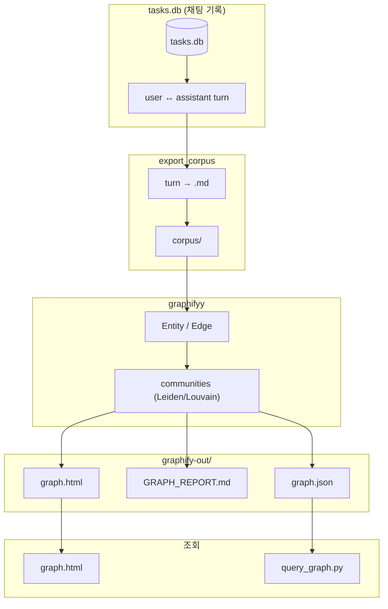
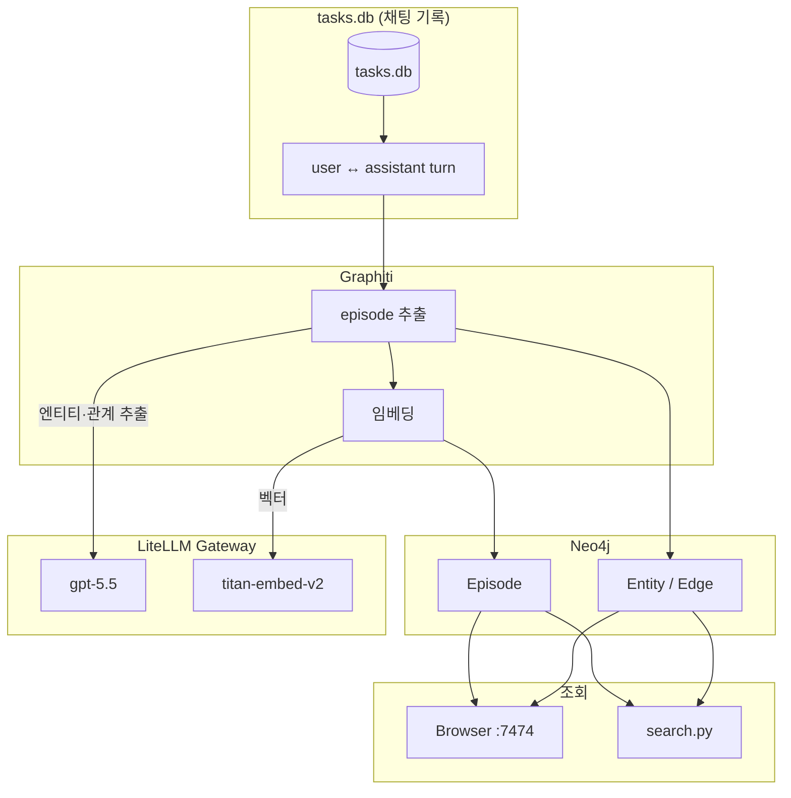

# Graphify vs Graphiti

Agent 채팅 DB(`tasks.db`)를 **지식 그래프로 만드는** 두 가지 로컬 접근을 비교합니다.

|                | **Graphify**                                          | **Graphiti**                                          |
| -------------- | ----------------------------------------------------- | ----------------------------------------------------- |
| 저장소 (이 워크스페이스) | `[graphify](https://github.com/kyopark2014/graphify)` | `[graphiti](https://github.com/kyopark2014/graphiti)` |
| 엔진             | **graphifyy** (PyPI)                                  | **graphiti-core** + LiteLLM                           |
| 저장             | 파일 (`graph.json` / `graph.html` / `GRAPH_REPORT.md`)  | **Neo4j** (live DB)                                   |
| 생성 방식          | corpus **배치** (+ 파일 캐시)                               | turn(**episode**) **증분**                              |
| 검색             | label 키워드 + BFS/DFS                                   | **hybrid** (벡터 + FTS + 그래프 + rerank)                  |
| 적합             | 일괄 분석·시각화·커뮤니티 리포트                                    | 장기 기억·지속 갱신·자연어 검색                                    |

**한 줄 결론**: 지속 갱신·자연어 검색·사실 시간축이 필요하면 **Graphiti**를 씁니다. Neo4j 없이 배치 시각화·커뮤니티 리포트가 우선이면 **Graphify**를 씁니다.

---

## 공통점

둘 다 같은 출발점에서 시작합니다.

1. **입력**: Agent가 남긴 SQLite `tasks.db`
2. **단위**: `user` 메시지 + 바로 다음 `assistant` 답변 = 하나의 **turn**
3. **의미 추출**: 텍스트 → 노드/엣지로 바꾸는 핵심에 **LLM** 사용
4. **목적**: 대화·도구·스킬 간의 관계를 그래프로 탐색

갈라지는 지점은 **추출 엔진, 저장소, 증분/배치, 검색 방식**입니다.

---

## 파이프라인 비교

### Graphify

1. `export_corpus.py` — turn을 마크다운 코퍼스로 기록
2. **graphifyy** — 문서에서 엔티티·관계 추출, 커뮤니티 클러스터링
3. `graph.html` / `query_graph.py` — 시각화·구조 탐색

로컬 repo는 **DB → corpus**까지이고, **실제 그래프 생성 엔진은 graphifyy**입니다.

### Graphiti

1. turn → **Episode JSON** (전처리만 로컬)
2. `graphiti.add_episode()` — LLM으로 엔티티·fact 추출, **dedup**, 임베딩
3. Neo4j 저장 → Browser / `search.py` hybrid 검색

로컬 코드는 thin wrapper이고, 지능은 **graphiti-core + LLM**에 있습니다.

---

## 항목별 비교

| 항목     | Graphify                         | Graphiti                        |
| ------ | -------------------------------- | ------------------------------- |
| 엔진     | graphifyy                        | graphiti-core + LiteLLM         |
| 추출 단위  | corpus 전체 배치 (파일별 캐시)            | turn(episode) 단위 증분             |
| 엔티티·관계 | LLM 시맨틱 (+ 코드는 AST)              | LLM structured JSON + **dedup** |
| 임베딩    | 없음 (유사성은 엣지로만 표현)                | entity/fact **벡터**              |
| 시간축    | `captured_at` 등 provenance 위주    | fact의 `valid_at` / `invalid_at` |
| 커뮤니티   | 핵심 (Leiden/Louvain + 라벨)         | 옵션 (기본 off)                     |
| 저장     | `graph.json` / `html` / `REPORT` | Neo4j live DB                   |
| 검색     | label 키워드 + BFS/DFS              | hybrid: 벡터 + FTS + 그래프 + rerank |
| 시각화    | `graph.html` (vis.js)            | Neo4j Browser `:7474`           |
| 인프라    | Python + graphifyy (DB 서비스 불필요)  | Docker Neo4j + LiteLLM 필수       |
| 비용     | 파일당 LLM (캐시로 재실행 절감)             | turn마다 LLM 수회 + embed           |
| 적합     | 코퍼스 감사·탐색 리포트                    | 에이전트 메모리·지속 지식                  |

### 스크립트 대응

| Graphiti            | Graphify                                   |
| ------------------- | ------------------------------------------ |
| `ingest.py` → Neo4j | `export_corpus.py` + graphifyy → HTML/JSON |
| Neo4j Browser       | `graph.html`                               |
| `search.py`         | `query_graph.py`                           |
| LiteLLM + embedding | graphify 시맨틱 추출 (LLM / AST)                |

---

## 언제 무엇을 쓸지

| 목표                        | 추천           | 이유                                         |
| ------------------------- | ------------ | ------------------------------------------ |
| 대화가 계속 쌓이는 장기 기억          | **Graphiti** | 증분 episode + temporal fact + hybrid search |
| 기존 `tasks.db` 일괄 분석·발표용 맵 | **Graphify** | 한 번 export로 HTML/REPORT/커뮤니티               |
| 로컬만, DB 서비스 없이 빠르게        | **Graphify** | 파일 산출물만으로 완결                               |
| “비슷한 사실”을 자연어로 찾기         | **Graphiti** | embedding + FTS + rerank                   |
| 허브 개념·커뮤니티 라벨 리포트         | **Graphify** | God Nodes / communities 기본 제공              |

---

## LLM의 역할

LLM은 DB나 클러스터링이 아니라 **의미 해석기**입니다. 텍스트에서 “무엇과 무엇이 어떻게 연결되는지”를 뽑습니다.

| 단계             | 담당                                      |
| -------------- | --------------------------------------- |
| turn/문서 읽기·포맷  | 로컬 스크립트 (`export_corpus`, `episodes` 등) |
| **의미 → 노드/엣지** | **LLM**                                 |
| 벡터·유사도         | Embedding 모델 (주로 Graphiti)              |
| 군집·저장·시각화      | Leiden/Neo4j/HTML 등                     |

### Graphify에서 LLM

- 문서(`.md`) **시맨틱 추출**: 노드·엣지·관계 타입·confidence
- (선택) 커뮤니티 **라벨링**: Leiden/Louvain이 나눈 그룹에 이름 부여
- 코드 파일이면 **AST**가 일부 대체합니다. 이 프로젝트 corpus는 마크다운이므로 LLM 추출이 핵심입니다.

### Graphiti에서 LLM

- **엔티티 추출** (`extract_nodes`)
- **관계(fact) 추출** (`extract_edges`)
- (검색 시) **rerank** — hybrid 후보 재순위
- 임베딩은 별도 모델(`titan-embed-v2`)이 담당하고, Neo4j는 저장소입니다.

LLM이 없으면 대화 로그만 남고, 지식 그래프의 의미 구조는 거의 만들어지지 않습니다.

---

## Graphify

관계는 그래프 DB나 Leiden/Louvain이 **계산**하는 것이 아닙니다. 추출 단계에서 **LLM(또는 코드 AST)이 edge JSON으로 명시**하고, 그다음 단계가 그 엣지를 모아 그래프·커뮤니티를 만듭니다.

### 관계 추출 흐름

`tasks.db` → `corpus/*.md`인 이 프로젝트 기준으로는 다음과 같습니다.

1. turn 마크다운을 20–25개씩 **chunk**로 나눕니다. (같은 디렉터리끼리 묶어 cross-file 관계를 잘 뽑게 합니다)
2. **graphifyy**가 파일(또는 chunk)마다 추출 프롬프트로 LLM에 **노드 + 엣지 JSON**을 요청합니다. (코드 파일은 AST로 구조 엣지를 먼저 뽑을 수 있습니다)
3. chunk 결과를 합치고 파일별 **캐시**(SHA256)에 저장한 뒤 NetworkX 그래프로 빌드 → `graph.json` / `graph.html` / `GRAPH_REPORT.md`.
4. **Leiden/Louvain**은 이미 만들어진 엣지 위에서 **커뮤니티만** 나눕니다. 새 관계를 발명하지 않습니다.

코드 파일이 섞이면 **AST(tree-sitter)** 가 import/호출 등 구조 엣지를 결정론적으로 뽑으며, LLM은 AST가 못 잡는 시맨틱 엣지 위주를 담당합니다. 현재 `graphify_pipeline/corpus`는 문서(`.md`)라 **거의 LLM 시맨틱 추출**입니다.

### `relation` 타입

추출 스키마가 허용하는 관계 이름(예):

| relation                  | 의미                                |
| ------------------------- | --------------------------------- |
| `references`              | 문서에서 명시적으로 가리킴                    |
| `calls`                   | 호출·사용                             |
| `implements`              | 구현                                |
| `cites`                   | 인용                                |
| `conceptually_related_to` | 개념상 관련                            |
| `shares_data_with`        | 데이터·상태 공유                         |
| `semantically_similar_to` | 구조 링크 없이 같은 문제/아이디어 (보통 INFERRED) |
| `rationale_for`           | “왜 그렇게 했는지” 설명 → 대상 개념            |

문서에서 task가 스킬을 쓰면 예:

`task_luxury_travel` —`references`[EXTRACTED]→ `skill_skill_creator`

`graphify_pipeline/graphify-out/graph.json` 한 번의 실행 예 (링크 수):

| relation                  | 대략 건수 |
| ------------------------- | ----- |
| `references`              | 113   |
| `calls`                   | 92    |
| `conceptually_related_to` | 42    |
| `semantically_similar_to` | 34    |
| `implements`              | 32    |
| `shares_data_with`        | 13    |
| `rationale_for`           | 11    |
| `cites`                   | 1     |

### confidence (감사 추적)

모든 엣지에 태그와 점수가 붙습니다. “찾은 것 vs 추론한 것”을 구분하는 Graphify의 핵심 설계입니다.

| confidence    | 의미                                         | confidence_score |
| ------------- | ------------------------------------------ | ---------------- |
| **EXTRACTED** | 원문에 드러남 (명시 언급, import, citation, “see …”) | 항상 `1.0`         |
| **INFERRED**  | 합리적 추론 (암시적 의존, 의미 유사 등)                   | 보통 `0.6`–`0.9`   |
| **AMBIGUOUS** | 불확실 — 생략하지 않고 검토용으로 남김                     | `0.1`–`0.3`      |

`--mode deep`이면 INFERRED를 더 공격적으로 뽑으며, 애매한 것은 AMBIGUOUS로 표시합니다.

동일 실행 예: EXTRACTED 261 · INFERRED 72 · AMBIGUOUS 5.

### hyperedge

쌍( pairwise ) 엣지만으로 부족한 **3개 이상 노드**의 공동 패턴은 `hyperedges`로 넣습니다. 예: 한 인증 플로우의 함수들, 한 섹션의 응집 개념. chunk당 최대 3개이며, 드물게 사용합니다.

### Graphiti fact와의 차이 (관계 관점)

|       | Graphify 관계                      | Graphiti fact                        |
| ----- | -------------------------------- | ------------------------------------ |
| 누가 뽑나 | graphifyy LLM(+AST) → JSON edge  | `graphiti-core` LLM → `RELATES_TO`   |
| 저장    | `graph.json` `links[]`           | Neo4j                                |
| 시간축   | 주로 `source_file` / `captured_at` | `valid_at` / `invalid_at`            |
| 중복 처리 | 파일 캐시·배치 재실행                     | entity **dedup** / fact invalidation |
| 유사성   | `semantically_similar_to` **엣지** | embedding **벡터** 검색                  |

정리: Graphify의 “관계”는 Neo4j가 계산한 결과가 아니라 **문서(또는 코드)를 읽은 LLM/AST가 JSON으로 적은 edge**이고, 그래프·커뮤니티·리포트는 그 위에 쌓입니다.

---

## Graphiti

관계(fact)도 Neo4j가 계산하지 않습니다. **turn → Episode JSON →** `graphiti.add_episode()` 안에서 LLM이 엔티티·fact를 뽑고, 임베딩·dedup·시간축 invalidation을 거친 뒤 Neo4j의 `RELATES_TO`로 저장합니다.

### 관계 추출 흐름

이 워크스페이스 `graphiti` 기준으로는 다음과 같습니다.

1. `tasks.db`에서 turn을 만들고 `turn_to_episode_body()`로 **Episode JSON**을 만듭니다
  (`user_message`, `assistant_reply`, `skills_configured`, `mcp_servers`, `tools_used` 등).  
   prompt/reply는 길이 **clip** (기본 2000/3000자).
2. `ingest.py`가 turn마다 `await graphiti.add_episode(...)`를 호출합니다.
  `source=EpisodeType.json`, `reference_time`은 메시지 시각.
3. **graphiti-core** 내부 (요약):
  - 이전 episode 컨텍스트 조회 (`previous_episodes`)
  - `extract_nodes()` — LLM structured output으로 엔티티 후보
  - `resolve_extracted_nodes()` — 기존 Entity와 **dedup/merge** (이름·임베딩 등)
  - `extract_edges()` — 확정된 엔티티 목록을 보고 LLM이 **fact triple** 추출
  - `resolve_extracted_edges()` — 기존 fact와 비교·병합, 모순되면 **invalidation**
  - Episode 저장 + `MENTIONS` (Episodic → Entity)
  - entity `name_embedding` / edge `fact_embedding` 생성 (LiteLLM `titan-embed-v2`)
4. (옵션) `update_communities=True`면 커뮤니티 갱신 — **이 프로젝트 기본은 off**

turn은 **순차 await**가 권장됩니다. 병렬 ingest는 Graphiti가 권하지 않습니다.

로컬 Python은 Episode JSON·오케스트레이션만 담당하고, 관계의 “의미”는 전부 **graphiti-core + LiteLLM LLM**이 만듭니다.

### fact / edge 스키마

LLM `extract_edges`가 뽑는 필드 (graphiti-core 프롬프트 기준):

| 필드                   | 의미                                                                         |
| -------------------- | -------------------------------------------------------------------------- |
| `source_entity_name` | 출발 엔티티 (ENTITIES 목록에 있는 이름)                                                |
| `target_entity_name` | 도착 엔티티                                                                     |
| `relation_type`      | 관계 종류, **SCREAMING_SNAKE_CASE** (예: `WORKS_AT`, `USES`, `CONFIGURED_WITH`) |
| `fact`               | 관계를 자연어로 요약한 문장 (원문 paraphrase)                                            |
| `valid_at`           | 이 fact가 참이 된 시각 (ISO 8601, 없으면 null)                                       |
| `invalid_at`         | 이 fact가 더 이상 참이 아니게 된 시각                                                   |

Neo4j에 저장될 때 대략:

- 관계 타입: `RELATES_TO` (엔티티↔엔티티 fact)
- 속성: `name`(≈ relation_type), `fact`, `valid_at`, `invalid_at`, `fact_embedding`
- 출처: Episode 노드 + `MENTIONS`

Graphify처럼 고정 enum(`references` / `calls` …)이 아니라, LLM이 문맥에 맞는 `relation_type` **문자열**을 생성합니다. (커스텀 `edge_types`를 넘기면 타입을 제한할 수 있습니다 — 이 repo ingest는 기본값을 사용합니다)

예 (개념):

`user` —`USES`→ `korea_weather`  
`fact`: "The assistant used the korea_weather MCP tool to answer the weather query."  
`valid_at`: turn의 `reference_time`

### Graphify confidence와의 대응

Graphiti 기본 추출에는 EXTRACTED/INFERRED **태그가 없습니다**. 대신:

| Graphify                         | Graphiti에 가까운 개념                                 |
| -------------------------------- | ------------------------------------------------ |
| EXTRACTED / INFERRED / AMBIGUOUS | (없음) — fact 문장 + temporal bounds로 표현합니다          |
| `confidence_score`               | (없음) — 검색 시 hybrid score / rerank를 사용합니다         |
| 파일 캐시로 “이미 뽑음”                   | Entity **dedup** + edge **resolve/invalidation** |
| `semantically_similar_to` 엣지     | **embedding**으로 유사 fact·entity 검색                |

새 episode가 옛 fact와 모순되면 `invalid_at`을 채워 **옛 관계를 무효화**할 수 있습니다. 이것이 Graphiti의 temporal (시간 인식) 지식 그래프 핵심입니다.

### 검색에서 관계가 쓰이는 방식

관계가 쌓인 뒤 `search.py` → `graphiti.search(query)`:

1. 쿼리 임베딩 ↔ `fact_embedding` **벡터** 유사도
2. fact/이름에 대한 **FTS**
3. 그래프 이웃 확장
4. (설정에 따라) **RRF**로 순위 융합 후 **rerank**

출력은 주로 `EntityEdge.fact` 문자열 목록입니다. Graphify의 BFS/DFS label 매칭과 달리 **의미·키워드 hybrid**입니다.

### Graphify 관계와의 차이 (관계 관점)

|        | Graphiti fact                              | Graphify 관계                        |
| ------ | ------------------------------------------ | ---------------------------------- |
| 누가 뽑나  | `graphiti-core` LLM → `RELATES_TO`         | graphifyy LLM(+AST) → JSON edge    |
| 추출 단위  | turn(episode) **증분**                       | corpus chunk **배치**                |
| 관계 이름  | 자유형 `relation_type` (SCREAMING_SNAKE_CASE) | 고정 enum (`references`, `calls`, …) |
| 신뢰도 태그 | 없음 (temporal + resolve)                    | EXTRACTED / INFERRED / AMBIGUOUS   |
| 시간축    | `valid_at` / `invalid_at`                  | `captured_at` / `source_file` 위주   |
| 중복·모순  | dedup + **invalidation**                   | 파일 캐시·재실행                          |
| 유사성    | embedding **벡터**                           | `semantically_similar_to` **엣지**   |
| 저장     | Neo4j live                                 | `graph.json` `links[]`             |

정리: Graphiti의 “관계”는 **episode마다 LLM이 뽑은 fact triple**이고, Neo4j는 저장·인덱스·hybrid 검색을 맡습니다. Graphify와 같이 “의미를 읽는 주체”는 LLM이지만, **증분·dedup·시간축·벡터 검색**이 기본 설계에 들어 있습니다.

---

## 주요 용어 사전

### 입력·전처리

| 용어                    | 의미                                                                                                                                                      |
| --------------------- | ------------------------------------------------------------------------------------------------------------------------------------------------------- |
| **tasks.db**          | Agent 앱이 남긴 SQLite입니다. `tasks`(세션/설정)와 `messages`(역할·본문·tool 이벤트) 테이블을 담습니다.                                                                            |
| **turn**              | `user` 메시지와 바로 이어지는 `assistant` 답변을 한 쌍으로 묶은 대화 단위입니다. 두 파이프라인의 기본 처리 단위입니다.                                                                            |
| **corpus**            | Graphify 입력용 마크다운 문서 모음입니다. turn마다 `corpus/turn-….md` (frontmatter + User/Assistant)로 export됩니다.                                                        |
| **Episode / episode** | Graphiti가 소화하는 사건 단위입니다. turn을 JSON으로 정리한 본문(`user_id`, `task`, `prompt`, `reply`, `tools_used` 등)을 `add_episode()`에 넘깁니다. Neo4j에는 `Episodic` 노드로 남습니다. |
| **provenance**        | “이 노드/관계가 어디서 왔는지” 출처입니다. Graphify는 `source_file` 등, Graphiti는 Episode + `MENTIONS`로 추적합니다.                                                             |

### 그래프 구성 요소

| 용어                           | 의미                                                                            |
| ---------------------------- | ----------------------------------------------------------------------------- |
| **Entity (엔티티)**             | 그래프의 **노드**입니다. 사람·서비스·스킬·개념·도구 등 “이름 붙일 수 있는 대상”입니다.                         |
| **Edge / 관계 / fact**         | 노드를 잇는 **엣지**입니다. Graphiti에서는 특히 fact 문자열과 시간 속성을 가진 `RELATES_TO`로 저장됩니다.     |
| **지식 그래프 (Knowledge Graph)** | 엔티티와 관계를 노드·엣지로 표현한 구조화된 지식입니다. 단순 문서 목록이 아니라 “누가/무엇이 무엇과 연결되는지”를 탐색할 수 있습니다. |
| **MENTIONS**                 | Graphiti에서 Episode → Entity를 잇는 관계입니다. “이 대화에서 그 엔티티가 언급됐다”는 provenance입니다.   |
| **hyperedge**                | Graphify `graph.json`에 있을 수 있는 **3개 이상 노드**를 한 묶음으로 잇는 확장 엣지입니다.              |
| **God Nodes**                | Graphify 리포트에서 **연결 차수(degree)가 높은 허브 노드**입니다. 그래프의 중심 개념 후보입니다.              |

### 추출·품질

| 용어                                            | 의미                                                                                                                          |
| --------------------------------------------- | --------------------------------------------------------------------------------------------------------------------------- |
| **시맨틱 추출 (semantic extraction)**              | LLM이 문장 의미를 읽어 엔티티·관계를 JSON 등으로 뽑는 과정입니다. Graphify 문서 파이프라인의 핵심입니다.                                                         |
| **AST 추출**                                    | Abstract Syntax Tree입니다. 코드 파일을 파서(tree-sitter 등)로 분석해 import/호출/클래스 관계를 **결정론적으로** 뽑습니다. LLM 비용이 없습니다. Graphify의 코드 경로입니다. |
| **structured output / structured JSON**       | LLM 응답을 자유 문장이 아니라 **정해진 JSON 스키마**로 받는 방식입니다. Graphiti 엔티티·엣지 추출에 사용합니다.                                                   |
| **dedup (de-duplication)**                    | **중복 제거**입니다. Graphiti에서 새 episode의 엔티티가 기존 Neo4j 엔티티와 같으면 새 노드를 만들지 않고 **merge/resolve**합니다. 이름 유사도·임베딩 등을 이용합니다.          |
| **confidence / EXTRACTED·INFERRED·AMBIGUOUS** | Graphify가 엣지에 붙이는 신뢰 태그입니다. 문서에 명시(EXTRACTED), 추론(INFERRED), 애매(AMBIGUOUS)로 구분합니다.                                          |
| **clipping**                                  | Graphiti 전처리에서 prompt/reply 길이를 잘라 LLM 입력 폭주·노이즈를 막습니다 (예: prompt 2000자, reply 3000자).                                      |

### 임베딩·검색

| 용어                               | 의미                                                                                                             |
| -------------------------------- | -------------------------------------------------------------------------------------------------------------- |
| **Embedding (임베딩)**              | 텍스트를 고정 길이 **실수 벡터**로 바꾼 표현입니다. 의미가 가까우면 벡터도 가깝습니다. Graphiti는 entity 이름·fact에 저장합니다.                           |
| **벡터 검색 (vector search)**        | 쿼리도 임베딩한 뒤, 저장된 벡터와 **코사인 유사도** 등으로 가까운 노드/엣지를 찾습니다. “비슷한 의미” 검색입니다.                                           |
| **FTS (Full-Text Search)**       | **전문 검색**입니다. 텍스트를 토큰(단어)으로 쪼개 인덱스에 넣고, 쿼리 단어가 포함된 문서를 빠르게 찾습니다. 고유명사·정확한 키워드에 강합니다.                           |
| **hybrid search**                | Graphiti 검색처럼 **여러 방식의 결과를 합치는** 검색입니다. 전형적으로 벡터 + FTS(+ 그래프 이웃 확장) 후 **rerank**합니다.                           |
| **RRF (Reciprocal Rank Fusion)** | 여러 랭킹 리스트를 순위 역수로 합쳐 하나의 순위로 만드는 기법입니다. Graphiti hybrid의 기본 융합 방식 중 하나입니다.                                     |
| **rerank**                       | 1차 후보를 LLM/크로스인코더로 다시 점수 매겨 상위만 남기는 단계입니다. Graphiti `OpenAIRerankerClient`를 사용합니다.                             |
| **BFS / DFS**                    | Breadth-/Depth-First Search입니다. Graphify `query_graph.py`가 `graph.json` 위에서 이웃을 **너비/깊이**로 탐색합니다. 벡터 검색이 아닙니다. |
| **label 키워드 매칭**                 | 노드 `label` 문자열에 질의어가 **부분 문자열**로 들어가는지 보는 단순 매칭입니다. Graphify 로컬 질의 시작점입니다.                                     |

### 커뮤니티·클러스터링

| 용어                     | 의미                                                                                               |
| ---------------------- | ------------------------------------------------------------------------------------------------ |
| **community (커뮤니티)**   | 서로 더 촘촘히 연결된 노드 그룹입니다. “주제 덩어리”입니다.                                                              |
| **Louvain**            | 모듈러리티 기반 **커뮤니티 탐지** 알고리즘입니다. 빠르고 널리 쓰입니다. Graphify에서 networkx로 fallback 가능합니다.                  |
| **Leiden**             | Louvain의 개선판입니다. 연결이 끊긴 덩어리를 덜 만들고 품질이 더 안정적인 편입니다. Graphify는 graspologic가 있으면 **Leiden 우선**입니다. |
| **cohesion**           | 커뮤니티 내부가 얼마나 잘 뭉쳤는지 나타내는 응집도 점수입니다. Graphify `GRAPH_REPORT.md`에 등장합니다.                           |
| **community labeling** | 숫자 ID뿐인 커뮤니티에 LLM이 **사람이 읽는 이름**을 붙이는 단계입니다 (예: “Bedrock AgentCore 아키텍처”).                       |

### 시간·증분

| 용어                           | 의미                                                                                                      |
| ---------------------------- | ------------------------------------------------------------------------------------------------------- |
| **증분 ingest**                | 그래프 전체를 다시 만들지 않고 **새 turn/episode만 추가**합니다. Graphiti의 기본 모델입니다.                                        |
| **배치 (batch)**               | 코퍼스(또는 파일 집합)를 모아 **한 번에** 추출·클러스터합니다. Graphify의 기본 모델입니다.                                              |
| **파일 캐시 / manifest**         | Graphify가 파일 SHA256·mtime으로 “이미 추출한 파일”을 건너뛰는 증분 장치입니다. Graphiti의 entity dedup과는 다른 층위입니다.              |
| **valid_at / invalid_at**    | Graphiti fact의 **유효 기간**입니다. 새 정보로 옛 fact가 더 이상 참이 아니면 invalidation합니다. **temporal (시간 인식) 지식 그래프**입니다. |
| **temporal knowledge graph** | 사실이 “언제부터 언제까지 참인지”를 함께 담는 그래프입니다. Graphiti의 차별점 중 하나입니다.                                               |

### 저장·인프라·패키지

| 용어                       | 의미                                                                                                       |
| ------------------------ | -------------------------------------------------------------------------------------------------------- |
| **Neo4j**                | 그래프 데이터베이스입니다. 노드·관계를 네이티브로 저장·질의(Cypher)합니다. Graphiti 저장소이며, LLM을 호출하지 않습니다.                            |
| **Cypher**               | Neo4j 질의 언어입니다. Browser에서 그래프를 직접 탐색할 때 사용합니다.                                                           |
| **NetworkX**             | Python 그래프 라이브러리입니다. Graphify가 메모리상 그래프를 빌드·클러스터·탐색할 때 사용합니다.                                            |
| **graphifyy**            | Graphify의 **PyPI 패키지 이름**입니다. `pip install graphifyy`. GitHub 제품명은 Graphify이며, CLI/모듈은 보통 `graphify`입니다. |
| **graphiti-core**        | Graphiti SDK (PyPI)입니다. `Graphiti.add_episode()`, `Graphiti.search()` 등입니다.                              |
| **LiteLLM Gateway**      | OpenAI 호환 게이트웨이입니다. Graphiti가 LLM(`gpt-5.5`)·임베딩(`titan-embed-v2`)을 **직접 OpenAI 키 없이** 호출합니다.            |
| **vis.js / vis-network** | 브라우저에서 노드·엣지를 그리는 JS 라이브러리입니다. Graphify `graph.html`에서 사용합니다.                                            |

### 산출물 (Graphify)

| 용어                         | 의미                                                                                  |
| -------------------------- | ----------------------------------------------------------------------------------- |
| **graph.json**             | NetworkX node-link JSON입니다. 노드·링크·(선택) hyperedges·community를 담으며, 재질의 원본입니다.        |
| **graph.html**             | 인터랙티브 시각화입니다. 검색·커뮤니티 색·클릭 패널을 제공합니다.                                               |
| **GRAPH_REPORT.md**        | God Nodes, Surprising Connections, Communities, Suggested Questions 등 감사/탐색 리포트입니다. |
| **Surprising Connections** | 커뮤니티/파일 경계를 **가로지르는** 의외의 엣지입니다. 리포트 하이라이트입니다.                                      |
| **Suggested Questions**    | 그래프 구조를 바탕으로 제안하는 후속 질문 목록입니다.                                                      |

### 산출물·스키마 (Graphiti)

| 용어             | 의미                                                                               |
| -------------- | -------------------------------------------------------------------------------- |
| **Episodic**   | 원본 episode 노드입니다. `name`, `content`, `source`, `valid_at`, `group_id` 등입니다.      |
| **Entity**     | 추출된 개체 노드입니다. `name`, `summary`, `name_embedding` 등입니다.                          |
| **RELATES_TO** | Entity↔Entity fact 관계입니다. `fact`, `valid_at`, `invalid_at`, `fact_embedding`입니다. |
| **group_id**   | 멀티테넌시/유저 분리용 파티션 키입니다. Community Edition에서는 제약이 있을 수 있습니다.                       |
| **search.py**  | `graphiti.search(query)` 래퍼입니다. hybrid 결과의 fact 목록을 CLI로 출력합니다.                  |

---

## 트레이드오프 요약

### Graphiti가 강한 점

- turn 단위 **증분 append**
- entity **dedup** / fact **invalidation**
- 자연어 **hybrid search**
- Episode **provenance** (`MENTIONS`)

### Graphiti 제약

- turn당 LLM·임베딩 **비용·지연**
- Docker Neo4j + LiteLLM **인프라 의존**
- community update **기본 off**
- prompt/reply **길이 clip**

### Graphify가 강한 점

- Neo4j 없이 **즉시 HTML/리포트**
- **커뮤니티·God Nodes·Suggested Questions**
- 추출 **confidence** 태그·파일 **캐시**
- cross-document 패턴을 한눈에

### Graphify 제약

- **벡터/동의어** 검색이 약함 (label + BFS/DFS)
- 그래프 생성이 로컬 전처리 밖에 있음 (**graphifyy** + LLM)
- 라이브 장기 기억(지속 갱신 메모리)으로는 **재빌드**가 필요하기 쉬움
- 대형 그래프 HTML viz **한계**

---

## 참고 경로

| 구분                     | 경로                                                                                                                               |
| ---------------------- | -------------------------------------------------------------------------------------------------------------------------------- |
| Graphify README        | `graphify/README.md`                                                                                                             |
| Graphify 파이프라인         | `graphify/graphify_pipeline/` (`export_corpus.py`, `query_graph.py`)                                                             |
| Graphiti README        | `graphiti/README.md`                                                                                                             |
| Graphiti ingest/search | `graphiti/graphiti_with_neo4j/ingest.py`, `search.py`                                                                            |
| upstream Graphify      | [Graphify-Labs/graphify](https://github.com/Graphify-Labs/graphify)                                                              |
| 형제 저장소                 | [kyopark2014/graphify](https://github.com/kyopark2014/graphify), [kyopark2014/graphiti](https://github.com/kyopark2014/graphiti) |
| 산출물 예시                 | `agent-wiki/application/graphify-out/`                                                                                           |

